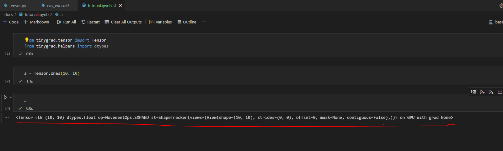

#### Quick Start Guide [https://github.com/tinygrad/tinygrad/blob/master/docs/quickstart.md]
- We got the Tensor class with all the operations that can be done to a tensor like initializing it from a np.array or a python list [1,2,4,4]. **abstractions.py** will help me understand how the operations on these tensors make their way down to the hardware.
#### So what is the problem that tinygrad is trying to solve exactly?
- Say I wanted to run a neural network on a raspberry pi? I should use TinyGrad?
-
#### And is it worth working on this problem?
- Will I have the knowledge and expertise to solve it. If not how long will it take for me to get to the level where I can be helping solve the problems in tinygrad?
- There is a lot of good stuff here. But I have to find something to start on. Start somewhere. I need to grab a foothold somewhere.
  - I really need to write a book about starting things.
- 
- What this says is that this is a tensor backed by a Lazy Buffer(**LB**). Tensors are on the GPU by default!

#### RISC vs CISC
- Geohot said RISC will win out
- CISC has complex instructions and RISC has simpler instructions
  - The code size of CISC is smaller
  - The code size of RISC is larger but it processes faster since it has simpler instructions.
  - So there are more instructions to execute in RISC but its fewer clock cycles since the instructions are simpler.

#### Abstraction.py
- This is the entry point to figure out the abstractions in this code base