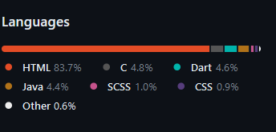

### Intro
#### Why Learn this?
- Little languages like YAML, JSON, etc are everywhere
- You may need to mess with a parser for one of these
- Langugges are a greate exercise.
  - You must master recursion, dynamic arrays, trees, graphs, and hash tables.
  - Interpreter isn't as daunting as you might believe but building one is a challenge worth pursuing.
- We are going to implement a interpreter in Java for PART 1 then do it again in C for PART 2 in PART 2 we will also have a compiler.
#### Challenges
1. There are at least six domain-specific languages used in the little system I cobbled together to write and publish this book. What are they?
   - 
2. C Hello World Program