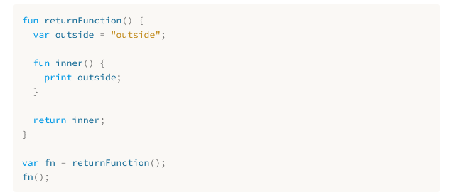

### THe Lox Language [https://craftinginterpreters.com/the-lox-language.html]
#### Hello Lox
- Its a member of the C Language family since that is what we will be most familiar with.
#### Dynamic Typing
- Lox is dynamically typed meaning a variable in Lox can store values of different types and the same variable can sometimes even store different types across different times.
- A statically typed language has more implementation details you need to implement.
#### Automatic Memory Management
- Don't have to manually manage the allocation and freeing of storage.
- Two methods to managing memory:
  - 1. Reference Counting
  - 2. Tracing Garbage Collection (also just called Garbage Collection)
- Ref counters are much simpler to implement. But the limitations of Ref Counters become too troublesome.
- Tracing Garbage collection has a fearsome reputation. It is a little nerve wracking working at the level of raw memory.
  - Debugging a GC can sometimes leave you seeing hex dumps in your dreams. This should be fun!! The algorithm is quite simple and fun to implement.
#### Data Types
- The atoms of Lox's universe are built-in data types:
  - Booleans, Numbers, Strings, Nil
  - There are good arguments for not having a null value in a language since null pointer exceptions are the scourage of our industry. If we were doing a statically typed language it would be worth trying to ban it but in a dynamically typed language eliminating the null value is more annoying than having it.
#### Expressions
- Expressions are the molecules. Built-in types and their literals are the atoms
- Examples:
  - *Arthmetic*
  - *Comparison and equality*
#### Comparison and equality
- We can compare numbers only using comparison operators (less than or greater than)
- Values of differnent types are never equivalent
- He is against implicit conversions
#### Logical Operators
- not, and, or
#### Statements
- print is a statement
#### Closures
- Implementing these will be fun
- 
- Implementing these adds some complexity because we can no longer assume variable scope works strictly like a stack where local variables evaporate the moment the function returns.
### Classes
- Since Lox has dynamic typing, lexcial (roughly "block") scope, and closures its about half way to being a *functional language*. But its also half way to being a *object-oriented language*
#### Why might any language want to be object oriented?
- It is true that "all inheritance all the time" produced some monstrous class hierarchies.
- Billions of lines of successful code have been written in OOP languages.
- Methods are scoped to object so you do not have to define that information in the function that you are creating you just have to create an object then extend from that object to implement the function.