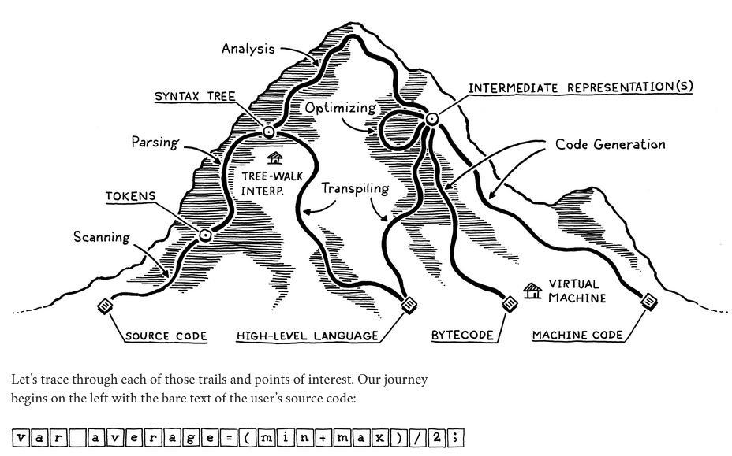

#### The Parts of a Language
- The way we build programming languages has been virtually unchanged since the dark ages of programming.
- 
#### Scanning
- Scanning takes in a bunch of characters and chunks them into something more like words.
  - Why would it go from characters to words. This analogy is not obvious to me aren't we supposed to be breaking things apart into lower levels?
#### Parsing
- This actually has its roots in the AI community where they were trying to get computers to talk to us. Turns out the strict grammer rules were too strict to be used with human language but perfect for programming languages.
- Parsing is where the Abstract Syntax Tree gets build
  - Its where the grammer of the language is build and its also where syntax errors are reported.
#### Static Analysis
- The first two stages are pretty similar in language implementations. Now the individual characteristics of languages start to come into play.
- this is where type checking and the region of where a variable is declared is identified so scoping also becomes a thing here.
- This is where the language gets its semantic meaning. We can use a symbol table here as well.
- Everything up to here is the **front end** of the implementation. There used to be just a **back end** following this but that was back when compilers were simpler. Now there is a **middle end** before the **back end**.
#### Intermediate Representations
- This is useful for when you want a source language to run on multiple CPUs. You can have a intermediate representation so you do not have to write a compiler for each architecture.
#### Optimization
- This is a rathole for people obsessed with optimizing code to get the compilers a little faster. Many successful languages have surprisingly few compile-time optimziations they focus most of their performance efforts on runtime (CPython, Lua).
- Once we understand what the user's program means we can swap it out for a more efficient implementation.
#### Code Generation
- It is hard to generate code to run on the CPU directly. There is a lot of historical baggage surrounding the design of CPUs.
- Virtual machine code is a better way to do this. Instead of producing code for a chip they do it for a hypothesized, ideal virtual machine
  - Okay then what?
  - And this is called bytecode
#### Virtual Machine
- You can convert the bytecode to native code which takes longer because you have to make the compilers compile for different architectures.
- Or you can use a Virtual Machine to convert the bytecode. Say you build the VM in C Language now your code will run on any machine that has a C compiler
  - This way of running the bytecode is slower than the native code approach but its easier to program.
#### Runtime
- If the code is run insde a interpreter or VM then the runtime lives there this is how Java, Python and JavaScript works
- The runtime is where type information is kept track of and where services are used to say do garabage collection.
### Shortcuts and Alternate Routes
- Many languages do the entire walk that we have written above but some languages take shortcuts.
#### Single-pass compilers
- Some simple compilers interleave arsing, analysis, and code generation so that they produce output code directly in the parser without worrying about syntax trees or other IRs (Intermediate Representations)
- **Single Pass Compilers**: There are no intermediate data structures to store global information about the program and you don't revisit any previously parsed part of the code. That means as soon as you see some expression, you need to know enough to correctly compile it.
  - Pascal and C were designed like this. that is why in C you can't call a function above the code that defines it unless uou have an explicit forward declaration that tells the compiler what it needs to know to generate code for a call to the later function.
#### Tree-walk Interpreters
- Some programming languages begin executing code right after parsing it to an AST. This is not used for production grade languages. Its mostly for school projects. Our first implementation of the interpreter will follow this approach.
#### Transpiler
- Like React being converted to javascript and html to be run.
- Use an existing language as the IR for your language and have that exisiting languages compiler do the compilation.
#### Just-in-time compilation
- Less a shortcut and more a dangerous alpine scramble best reserved for experts
- When the program is loaded you compile the code to the machine code that will work on the user's architecture.
#### Compilers and Interpreters
- What's the difference between a compiler and a interpreter?
  - They share some stuff and our exclusive in some other things.
  - Compilation is the implementation technique of translating one language to another form of a language usually something more lower level.
  - Interpreter implementation is when it takes in source code and executes it immediately.
  - C Language has a compiler like GCC or Clang
  - Ruby is a interpreter implementation
  - CPython is an interpreter and it has a compiler. It runs on a VM.
#### Our Journey
- This isn't the chapter where you are expected to understand all of these things.
- Hope this has inspired me to explore further than what the book talks about it or sooner than when the book goes to talk about it.
#### Challenges
1. Pick an open source implementation of a language that you like. (Python, OpenJDK) Download the source code and poke around in it. (What is meant by source code?). Try to find the code that implements the scanner and parser. Are they handwritten, or generated using tools like Lex and Yacc? (.l or .y files usually implt the latter)