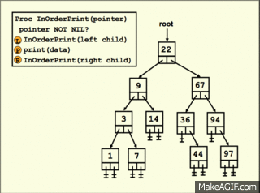
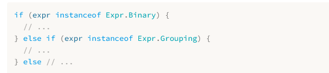
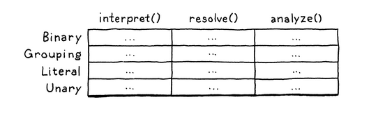
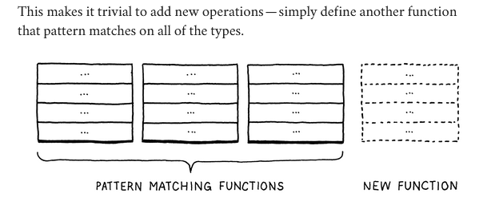
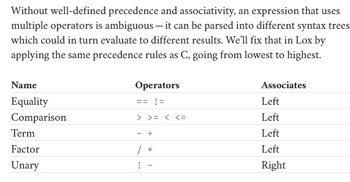

## High Level Overview ?
### Scanning
- the first step in any compiler or parser is the scanning portion. It takes in the raw source code and converts it into "**tokens**". These are the meaningful "words" and "punctuation" of that make up the languages grammer.
- Scanning is a good starting point for me learning as well because it isn't very hard it involves a switch statement mostly.
- Error handling happens here too. If you care about making a language that's actually useful then error handling is a big part of it.
  - Its good engineering practice to separate the code that generates the error vs. the code that reports them.
- 
- a **lexeme** is the smallest sequence that can still represent something.
- However the lexemes are still the raw source code when we process groping character sequences into lexemes we stumble upon other useful information. When we take the lexeme and bundle it together with that information we get **tokens**
- The core of the scanner is a loop.
- **Lexical Grammer**: the rules(regex) that determines how the raw source code gets lexemized
  - There are tools like Lex and Flex that will spit out a complete scanner for you if you throw a handful of regexes at it.
- Engineering strategy for handling comments. Keep eating characters in a while loop until you see the end of the line.
- **Important**: Everytime the scanner goes to the next character there is a postfix ++ operator so its reading the character at the current value then incrementing the counter to the next.
  - So as we are scanning the current letter there is also a way to see the next letter without incrementing the counter.
  - current is the counter that keeps track of the current **unconsumed** character
- Lox supports multiline strings. 
- **Maximal Munch**: When two lexical grammer rules can both match a chunk of code that the scanner is looking at, *whichever one matches the most characters wins*
  - Example reserved keyword **or** and variable name **orchid**
### Parsing (Expressions)
- Converting the tokens from the scanning portion into a **syntax tree**
### Evaluating Code (Expressions)
- We are going to **execute** the syntax tree itself.
- Language implementations can make a computer do what the source code commands by compiling it to machine code, transpiling it by converting it to another high-level language, or reduce it some bytecode format for a virtual machine to run.
### Representing Code
#### Context Free Grammer
- We used regular expressions to identify the lexemes in the last chapter. Now we have to use context free grammer to handle expressions which can be nested arbitrarily deep.
- How can we define a grammer with infinite variations?
  - we define a finite set of rules.
#### Rules for Grammer
- The language that you produce from the rules of the grammer are called derivations.
- Rules are called productions because they produce the things you see in the grammer.
- **Terminal**: Are the literals from the language. For example for us it would be like *if* or *1234*
- **Non-Terminal**: is a named reference to another rule in the grammer.
- All language rules are basically derivations of the BNF form from the 20th century. Not much innovation has happened in this area since then.
- Recursion in a language is a good sign that it is a context free language and not regular. 
- 
- The fact that a rule can refer to itself directly or indirectly allows us to produce infinite variatons of strings from a finite grammer set.
- As you work on programming languages, you'll find that context-free grammers help you crystallize your informal syntax design ideas.
- The rules and productions we define for Lox are also our guide to the tree data structure we are going to implement to represent code in memory
- **Rules** are called **productions** because they produce strings in the grammer.
- Enhancing the notation for efficiency. 
- For the Scanner potion we created code in regex for the *lexical grammer*. Now we are going to do the **syntactic grammer**.
  - Why is this needed?
#### Implementing Syntax Trees
- We are going to build a subset version of the language first so there is not too much to build for the **syntactic grammer**.
- We are going have a handful of expressions:
  - **Literals**: Numbers, strings, Booleans, and *nil*
  - **Unary Expressions**: A prefix *!* to perform a logical not, and *-* to negate a number.
  - **Binary Expressions**: The infix arithmetic (+, -, *, /) and logic operators (==, !=, <, <=, >, >=)
  - **Parentheses**: A pair of ( ) wrapped around an expression.
  - Here is the grammer 
- Since the grammer is recursive notice how *grouping, unary* and *binary* all refer back to *expression* our data structure will form a tree.
- Since this structure represents the syntax of our language it's called a **syntax tree**.
#### Disoriented Objects
- There are no objects in the Expr subclasses just like our Token class. Its a dumb structure. This is because the tree classes are not owned by any single domain
  - Should they have methods for parsing since that is where the trees are created? Or interpreting since that's where they are consumed. Trees span the border between both of those territories.
  - Expr Abstract class with Binary Subclass 
  - Token class 
    - And its uses for Comparison 
  - It feels weird to separate the behavior from where the data resides in Java because its an object oriented programming language. But the data structures are needed to flow between different phases/parts of the interpreter.
#### Recursion and Abstract Syntax Trees
- Here is a reference for recursion with a stack. 
- In order printing of a Binary Search Tree. 
#### Working with Trees (Why the code is designed the way it is)
- We can do a long chain of type tests for our expressions but then the expressions that are towards the end of the chain will take longer to execute 
- We have a family of subclasses in Expr and we need to associate behavior to them. We can give those subclasses instance methods but since they will have to be extended from in multiple domains then it will violate separation of concerns and lead to hard-to-maintain code.
#### Object Oriented vs. Functional Programming Paradigm
- Object Orientation 
- Functional Paradigm 
- In functional paradigm the behavior is defined separately from the type by functions. In Object Oriented programming we couple the object and the behavior together. Object oriented programming is oriented towards the object. Functional Programming is oriented towards the functions.
- Problems we face with building *expression syntax trees* with both programming paradigms
  - In object oriented programming its difficult to share types across domains. Because every domain will have to implement every function in the type even if its not related to their domain.
  - In functional programming if you add something to a type then you will have to go and add a pattern matcher for that type into the "behavior" functions
  - They call these two problems the **expression problem**
#### Chapter 5: The Visitor Pattern (the solution to the expression problem)
- The vistor pattern is not about traversing syntax trees!
- The visitor pattern is really about approximating the functional style within OOP langauge. It lets add new columns to that table easily. the implementation looks complex but what its trying to achieve is very simple.
- Recap of Visitor Pattern 3 days later what exactly is it? So its approximating functional style within a OOP language like Java. How is it doing that?
  - You have an abstract class and child classes that extend from the abstract class.
  - Then you a "visitor" interface with methods for each of those child classes to "visitChild1", "visitChild2"
    - Then the abstract class has an abstract method **accept** which is implemented by the child classes. In the parameter of the abstract accept(VisitorInterface visitor). In the child classes it calls the appropriate visitChild1, visitChild2 method.
- So its approximating the functional style by using an interface. I bet the abstract piece is important also. But I am drawn to whatever the interface is doing as representing the functional side.
#### Chapter 6: Parsing Expressions
- Parsing is transmogrifying a sequence of tokens into a syntax tree.
- When we are parsing we are tracking which rules lead to which tokens so we know what part of the language the tokens belong to. So understanding what rules produce what type of tokens is important.
- the rules are ambigious
  - which leads to the fact that they produce the same strings but not the same syntax trees.
  - We use two concepts to solve this problem of ambiguity: 1. Precedence, 2. Associativity
- **Precendence**: determines which operator is evaluated first in an expression containing a mixture of different operators.
- **Associativity**: determines which operator is evaluated first in a serios of the same operator. When an operator is left-associative (think "left to right") operators on the left evaluate before those on the right.
- 
#### Recursive Descent Parsing Chapter 6.2
- There are a lot of parsing techniques but the simplest one that will just require handwritten code is called **recursive descent**
  - You do not need to use a complex parser generator tool like Yacc, Bison, or ANTLR. All you need is straight up handwritten code.
- Recursive descent parsers are fast, robust, and can support sophisticated error handling.
- Recursive descent is considered a **top-down parser** because it starts from the top of outermost grammar rule (here *expression*) and works its way down into the nested subexpressions before finally reaching the leaves of the syntax tree.
- The descent is described as "recursive" because when a grammar rule refers to itself - directly or indirectly - that translates to a recursive function call.
#### Stopped at 6.3