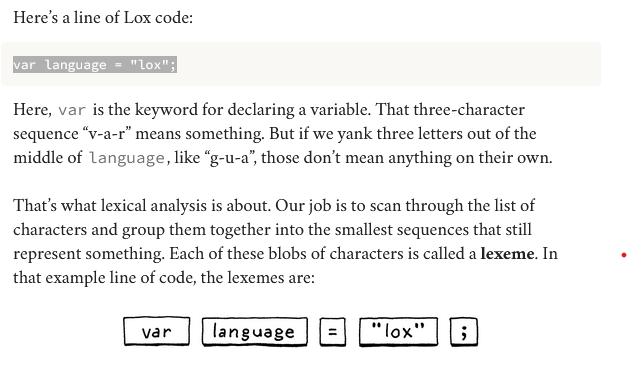
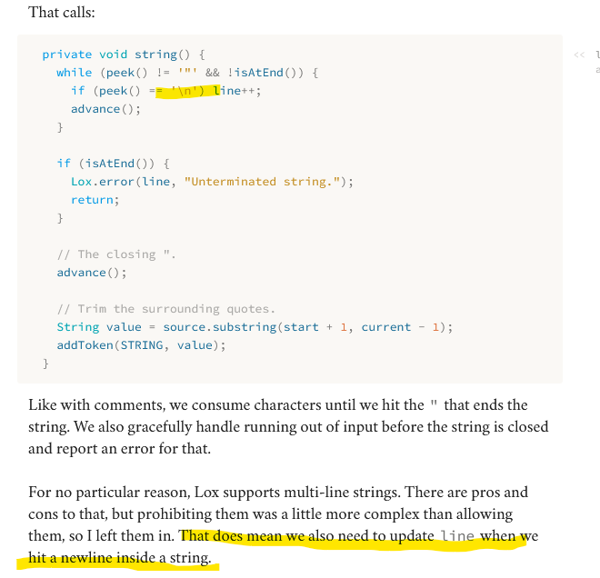
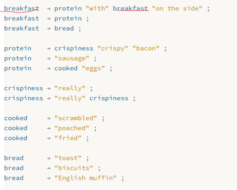
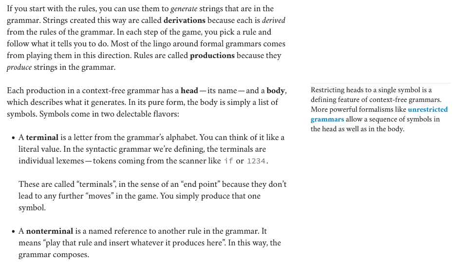
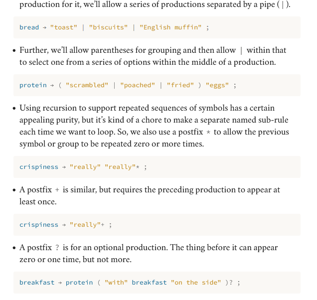
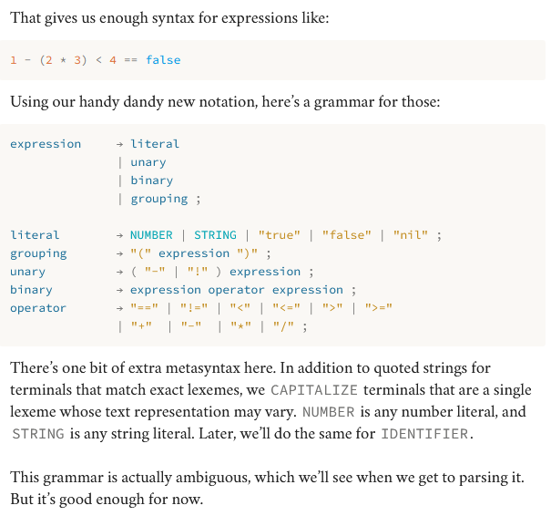
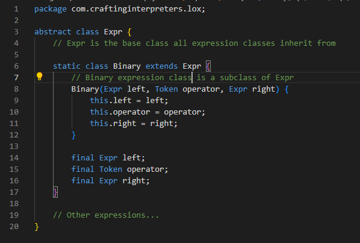
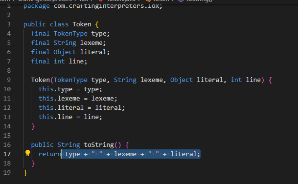
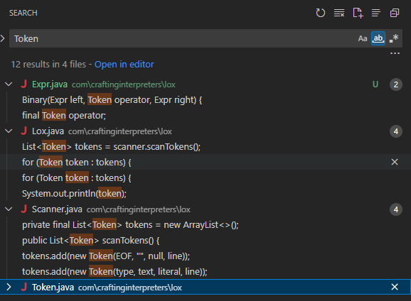

## High Level Overview ?
### Scanning
- the first step in any compiler or parser is the scanning portion. It takes in the raw source code and converts it into "**tokens**". These are the meaningful "words" and "punctuation" of that make up the languages grammer.
- Scanning is a good starting point for me learning as well because it isn't very hard it involves a switch statement mostly.
- Error handling happens here too. If you care about making a language that's actually useful then error handling is a big part of it.
  - Its good engineering practice to separate the code that generates the error vs. the code that reports them.
- 
- a **lexeme** is the smallest sequence that can still represent something.
- However the lexemes are still the raw source code when we process groping character sequences into lexemes we stumble upon other useful information. When we take the lexeme and bundle it together with that information we get **tokens**
- The core of the scanner is a loop.
- **Lexical Grammer**: the rules(regex) that determines how the raw source code gets lexemized
  - There are tools like Lex and Flex that will spit out a complete scanner for you if you throw a handful of regexes at it.
- Engineering strategy for handling comments. Keep eating characters in a while loop until you see the end of the line.
- **Important**: Everytime the scanner goes to the next character there is a postfix ++ operator so its reading the character at the current value then incrementing the counter to the next.
  - So as we are scanning the current letter there is also a way to see the next letter without incrementing the counter.
  - current is the counter that keeps track of the current **unconsumed** character
- Lox supports multiline strings. 
- **Maximal Munch**: When two lexical grammer rules can both match a chunk of code that the scanner is looking at, *whichever one matches the most characters wins*
  - Example reserved keyword **or** and variable name **orchid**
### Parsing (Expressions)
- Converting the tokens from the scanning portion into a **syntax tree**
### Evaluating Code (Expressions)
- We are going to **execute** the syntax tree itself.
- Language implementations can make a computer do what the source code commands by compiling it to machine code, transpiling it by converting it to another high-level language, or reduce it some bytecode format for a virtual machine to run.
### Representing Code
#### Context Free Grammer
- We used regular expressions to identify the lexemes in the last chapter. Now we have to use context free grammer to handle expressions which can be nested arbitrarily deep.
- How can we define a grammer with infinite variations?
  - we define a finite set of rules.
#### Rules for Grammer
- The language that you produce from the rules of the grammer are called derivations.
- Rules are called productions because they produce the things you see in the grammer.
- **Terminal**: Are the literals from the language. For example for us it would be like *if* or *1234*
- **Non-Terminal**: is a named reference to another rule in the grammer.
- All language rules are basically derivations of the BNF form from the 20th century. Not much innovation has happened in this area since then.
- Recursion in a language is a good sign that it is a context free language and not regular. 
- 
- The fact that a rule can refer to itself directly or indirectly allows us to produce infinite variatons of strings from a finite grammer set.
- As you work on programming languages, you'll find that context-free grammers help you crystallize your informal syntax design ideas.
- The rules and productions we define for Lox are also our guide to the tree data structure we are going to implement to represent code in memory
- **Rules** are called **productions** because they produce strings in the grammer.
- Enhancing the notation for efficiency. 
- For the Scanner potion we created code in regex for the *lexical grammer*. Now we are going to do the **syntactic grammer**.
  - Why is this needed?
#### Implementing Syntax Trees
- We are going to build a subset version of the language first so there is not too much to build for the **syntactic grammer**.
- We are going have a handful of expressions:
  - **Literals**: Numbers, strings, Booleans, and *nil*
  - **Unary Expressions**: A prefix *!* to perform a logical not, and *-* to negate a number.
  - **Binary Expressions**: The infix arithmetic (+, -, *, /) and logic operators (==, !=, <, <=, >, >=)
  - **Parentheses**: A pair of ( ) wrapped around an expression.
  - Here is the grammer 
- Since the grammer is recursive notice how *grouping, unary* and *binary* all refer back to *expression* our data structure will form a tree.
- Since this structure represents the syntax of our language it's called a **syntax tree**.
#### Disoriented Objects
- There are no objects in the Expr subclasses just like our Token class. Its a dumb structure. This is because the tree classes are not owned by any single domain
  - Should they have methods for parsing since that is where the trees are created? Or interpreting since that's where they are consumed. Trees span the border between both of those territories.
  - Expr Abstract class with Binary Subclass 
  - Token class 
    - And its uses for Comparison 
  - It feels weird to separate the behavior from where the data resides in Java because its an object oriented programming language. But the data structures are needed to flow between different phases/parts of the interpreter.