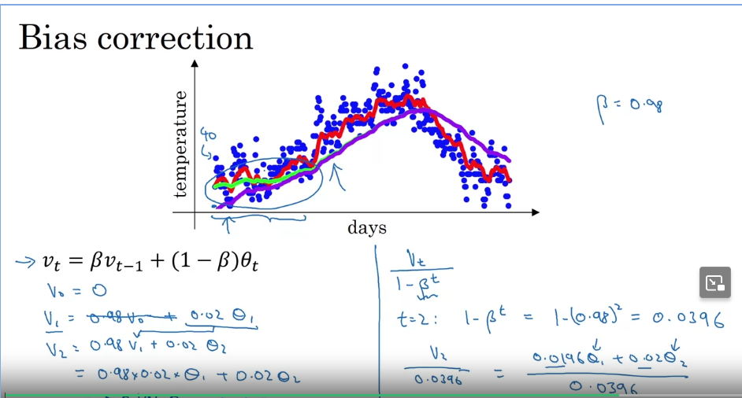
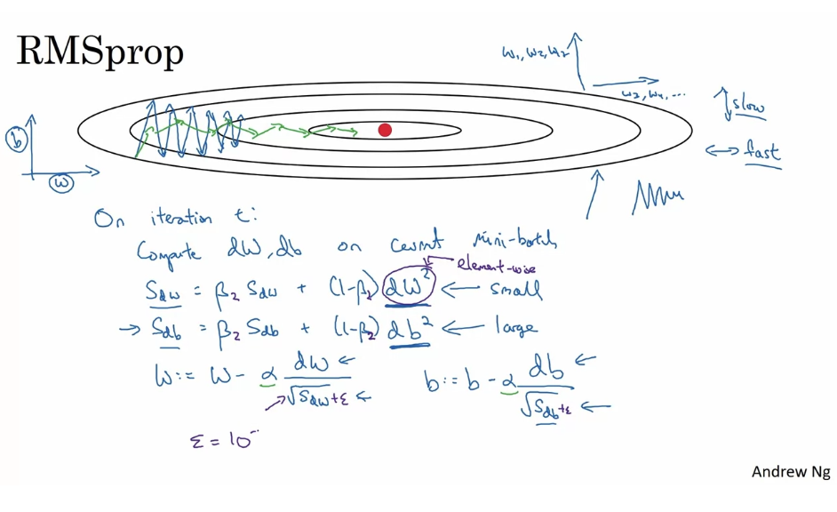
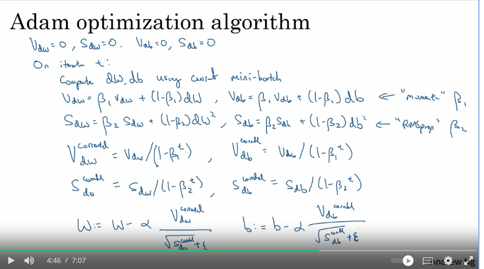
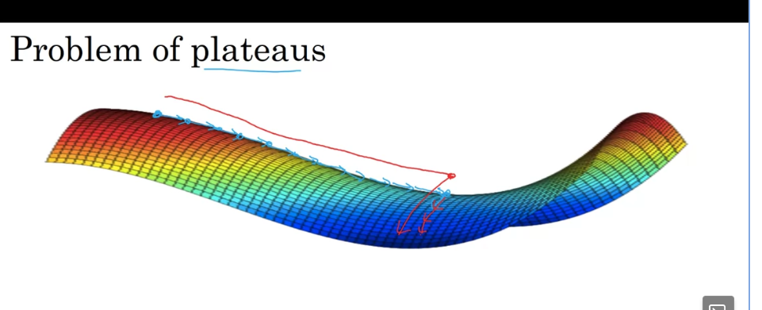

## Optimization Algorithms
### Mini-batch Gradient Descent
#### Batch vs. mini-bathc gradient descent
- Deep learning requires a lot of data
- Mini-batch allows you to make more progress by splitting your data set into mini batches
- batch gradient descent is where you process your entire training set at the same time
#### Mini-batch gradient descent
- for t = 1,....,5000
  - 1 step of gradient desc using X^t, Y^t (as if m = 1000)

### Understanding Mini-batch Gradient Descent
#### Training with mini batch gradient descent
- The cost will not go down on every iteration there will be some "wiggle"
- It should trend downwards over time.
- If mini-batch = m : BAtch gradient descent
- If mini-batch size =1 : Stochastic gradient descent. Every example is its own mini batch.
- 
- In practice mini-batch size will be in between 1 - m.
  - This will be the fastest learning
  - Make progress without going through entire training set.
#### Choosing your mini-batch size
- If small trainign set(m <= 2000): Use Batch Gradient
- Typical mini-batch sizes: 64, 128, 256, 512. Use powers of 2.
- Make sure mini batch: X^t, Y^t make sure it fits in your CPU and GPU memory
- Mini-batch size is another hyperparameter that you will do a search over to find the one that does the best on the cost function

### Exponentially Weighted Averages
#### Temperature in London Example
- How would we compute the trend using the local average?
  - V0 = 0
  - V1 = 0.9 * V0 + 0.1 * t1
  - V2 = ...
  - ...
    - We are taking the 0.9 times the previous days v value with 0.1 times the current day's temperature.
  - We get a exponentially weighted average when we graph this.
  - 
#### Exponentially Weighted Averages
- The purpose of using exponentially weighted avaeraged is to give more importance to recent observations while still considering historical data, allowing you to capture trends and changes in the data over time.
- V$_t$ = $\beta$V$_{t-1}$ + (1-$\beta$)$\theta_{t}$
  - Where V$_{t-1}$ is the previous values
  - $\theta$ is the current days temperature
- V$_t$ as approximately average over $\sim$ $1/1-\beta$ days temperature
- $\beta = 0.9 \sim$ 10 days temperature
- $\beta = 0.98 \sim$ 50 days
- $\beta = 0.5 \sim$ 2 days
- 
- The green line is 0.98, the red line in 0.9, and the yellow line is 0.5.
- I think what this is trying to show is that a higher $\beta$ averages better over longer periods of time while a smaller $\beta$ averages better over a shorter period of time because its so sensitive to changes.
- This is called a exponentially weighted MOVING average

### Understanding Exponentially Weighted Averages
- This will turn out to be a key component in many optimization algorithms.
- v$_t$ = $\beta$v$_{t-1}$ + (1-$\beta$)$\theta_t$
- v$_100$ = 0.1$\theta_{100}$ + 0.9V$_{99}$(0.1$\theta_{99}$ + 0.9$v_{98}$)
  - $v_{98}$ = 0.1$\theta_{98}$ + 0.9V$_{97}$
  - ....
- Its exponentially increasing function going from left to right
- I am not sure what this is going to be used for so I do not know what to do with this.
- Oh this can help with memory so you do not have to store all of the values to calculate the average.

### Bias Correction in Exponentially Weighted Average
- v${_t}$ = $\beta$v$_{t-1}$ + (1-$\beta$)$\theta_t$
- For the first couple of days this is not a good estimate of the average so there is a better way to do this.
  - Add a bias term
  - $\dfrac{v_t}{(1-\beta^t)}$
    - This is bias correction
  - 
    - The purple line is the bias correction
  - Exponentially weighted moving averages is what we just calculated

### Gradient Descent with Momentum
- Basically calculate a exponentially weighted average of your gradients.
  - I have to play around with exponentially weighted averages! TODO baby!'
- Very efficient from a computation and memory perspective.
#### Gradient Descent Example
- trying to keep the oscillations from getting too big means that you try to choose a optimal learning rate.
- Gradient Descent with momentum:
  - On iteration t:
    - Compute dw, db on current mini-batch
  - V$_{dw}$ = $\beta$V$_{dw}$ + (1-$\beta$)dw
  - V$_db$ = $\beta$V$_{db}$ + (1-$\beta$)db
  - w = w - $\alpha$V$_{dw}$, b = b - $\alpha$V$_{db}$
  - With this algorithm the oscillations in the vertical direction will average out to zero and because of that it will lessen over time.
    - It will move faster in the horizontal direction
    - Intuitively: Its like a ball rolling down the hill
- Hyperparamters: $\alpha$, $\beta$
  - $\beta$ = 0.9 works well over average over loss $\sim$ 10 gradients
    - I think the reasoning behind this was in the last video and I am going to review it and explain it here.
    - Explanation:
      - $\beta$ = 0.9 $\sim$ 10 days temp
        - $\dfrac{1}{1-0.9}$ = 10
      -  $\beta$ = 0.98 $\sim$ 50 days temp
         -  $\dfrac{1}{1-0.98}$ = 50
      - $\beta$ = 0.5 $\sim$ 2 days temp
         -  $\dfrac{1}{1-0.5}$ = 2
        - Still what does this mean?
          - idk
- How about bias correction?
  - In practice we do not use this because after 10 iterations the moving average will have "warmed up" and is longer requiring a bias estimate.
- The literature on gradient descent with momentum the (1-$\beta$) term is omitted.
  - V$_{dw}$ = $\beta$V$_{dw}$ + dw is what usually gets used and this because of
    -  w = w - $\alpha$V$_{dw}$, b = b - $\alpha$V$_{db}$
    -  this is not intuitive
    -  One impact of this if you tune the hyperparameter $\beta$ you might need to retune the learning rate as well.
       -  So the (1-$\beta$) might be better.
### RMSprop
- This is another way to accomplish the same thing as gradient descent with momentum.
- In the horizontal direction we want learning to go fast. In the vertical direction we want it to be slow.
- 
  - The updates in the horizontal direction are divided by a much smaller number
  - The updates in the vertical direction are divided by a much larger number
- In practice dw is a very high dimensional parameter vector and db is a very high dimensional parameter vector.
- Similar to the gradient descent with momentum it dampens out the oscillations.

### Adam Optimization Algorithm
- You can put together momentum and RMS Prop to get this!!!
- It has been shown to work well across a wide range of neural network algorithms
- 
  - Combines gradient descent with momentum with RMSprop.
- Hyperparameters:
  - $\alpha$ needs to be tuned
  - $\beta_1$ = 0.9 (dw)
  - $\beta_2$ = 0.999 (dw$^2$)
  - $\epsilon$ = 10$^{-8}$
  - The last three values are usually kept as they are especially $\epsilon$
  - Adam: Adaptive Moment Estimation

### Learning Rate Decay
- It may never converge because there is some noise in the mini batches and the $\alpha$ stays constant.
- Having a slower learning rate allows you to take smaller steps
- 1 epoch = 1 pass through the training set
- $\alpha$ = $\dfrac{1}{1+decay\_rate*epoch_num}$ * $\alpha_0$
- There are other learnung rate decay methods:
  - Exponentially decay etc...
  - Manual Decay LOL
- Learning rate decay is lower down on list for hyperparameter tuning strategies that Andrew Ng tries

### The Problem of Local Optima
- Local optima are not likely to happen its more likely to be at the saddle point checkout graph below. Local optima are to the left.
  
#### Problem of Plateaus
- Plateaus can really be a problem.

#### Takeaways
- Unlikely to get stuck in a bad local optima. If:
  - You are training a reasonably large neural network and the cost function j is defined over a relatively high dimensional space.
  - It seems like having a lot of parameters helps avoid local optima
- Neural Networks are solving optimization problems over such high dimensional spaces no one has a good intuition of how these high dimensional spaces look like.
