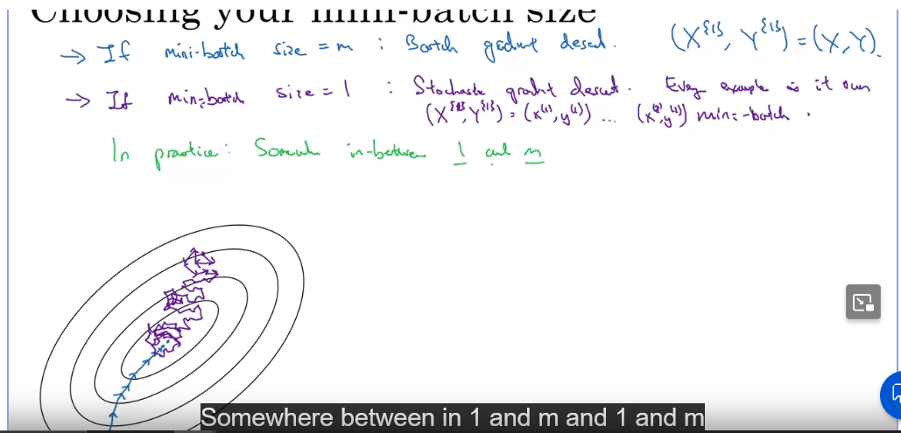
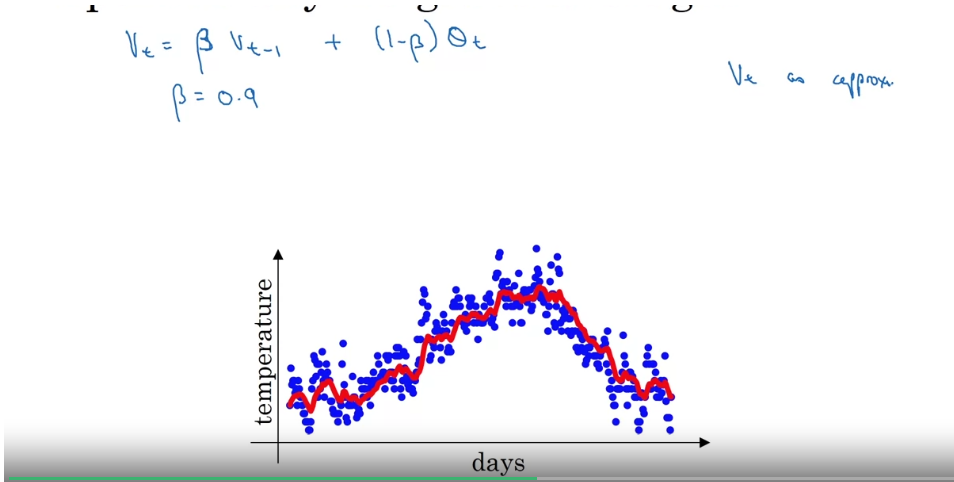
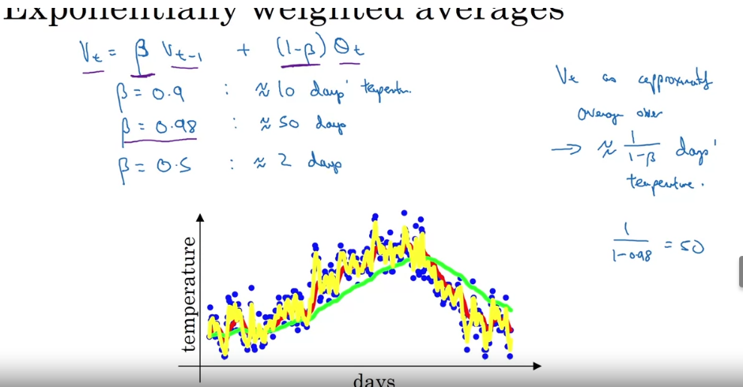

## Optimization Algorithms
### Mini-batch Gradient Descent
#### Batch vs. mini-bathc gradient descent
- Deep learning requires a lot of data
- Mini-batch allows you to make more progress by splitting your data set into mini batches
- batch gradient descent is where you process your entire training set at the same time
#### Mini-batch gradient descent
- for t = 1,....,5000
  - 1 step of gradient desc using X^t, Y^t (as if m = 1000)

### Understanding Mini-batch Gradient Descent
#### Training with mini batch gradient descent
- The cost will not go down on every iteration there will be some "wiggle"
- It should trend downwards over time.
- If mini-batch = m : BAtch gradient descent
- If mini-batch size =1 : Stochastic gradient descent. Every example is its own mini batch.
- 
- In practice mini-batch size will be in between 1 - m.
  - This will be the fastest learning
  - Make progress without going through entire training set.
#### Choosing your mini-batch size
- If small trainign set(m <= 2000): Use Batch Gradient
- Typical mini-batch sizes: 64, 128, 256, 512. Use powers of 2.
- Make sure mini batch: X^t, Y^t make sure it fits in your CPU and GPU memory
- Mini-batch size is another hyperparameter that you will do a search over to find the one that does the best on the cost function

### Exponentially Weighted Averages
#### Temperature in London Example
- How would we compute the trend using the local average?
  - V0 = 0
  - V1 = 0.9 * V0 + 0.1 * t1
  - V2 = ...
  - ...
    - We are taking the 0.9 times the previous days v value with 0.1 times the current day's temperature.
  - We get a exponentially weighted average when we graph this.
  - 
#### Exponentially Weighted Averages
- V$_t$ = $\beta$V$_{t-1}$ + (1-$\beta$)$\theta_{t}$
- V$_t$ as approximately average over $\sim$ $1/1-\beta$ days temperature
- $\beta = 0.9 \sim$ 10 days temperature
- $\beta = 0.98 \sim$ 50 days
- $\beta = 0.5 \sim$ 2 days
- 
- I think what this is tryign to show is that a higher $\beta$ averages better over longer periods of time while a smaller $\beta$ averages better over a shorter period of time because its so sensitive to changes.
- This is called a exponentially weighted MOVING average

### Understanding Exponentially Weighted Averages
- This will turn out to be a key component in many optimization algorithms.
- v$_t$ = $\beta$v$_{t-1}$ + (1-$\beta$)$\theta_t$
- 