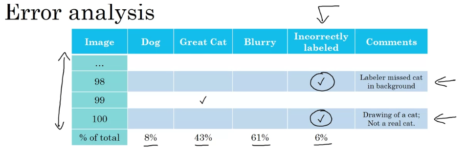

### Week 2 Course 3 Deep Learning
### Error Analysis
#### Carrying Out Error Analysis
- Andrej said it was suprising how many different tasks you can fine tune an AI model to work on well.
- See if its worth it to improve the error rate of a ML model. Base it on how much of that data is actually in your dataset.
  - For example say you have a 100 images and 5 images are of dogs in the data set and 5% of it is mislabeled in the dev set. And you have a total train error of 10%. It may not be worth it to focus on improving the loss because there won't be much reduction in the training error rate.
#### Evaluate Multiple Ideas in Parallel
- You can use a spread sheet to evaluate what gets mislabeled incorrectly and labeled correctly in the dataset
- Find your mislabeled categories in the dev set(because the dev set is what you use for tuning.). You can create new categories if you notice something particular that is messing up your classifier.
#### Cleaning Up Incorrectly Labeled Data
- The human label on the data is incorrect in the train set.
- DL algorithms are quite robust to random errors in the training set!
  - Wow! Why?
- Incorrectly Labeled Data on Dev or Test set
  - In your error analysis spreadsheet have a column for Incorrectly Labeled data.
  - 
  - Plot errors for:
    - Overall dev set error
    - Errors due to incorrect labels
    - Errors due to other causes
- Goal of dev set is to help you select between two classifiers A & B.
#### Correcting incorrect dev/test set examples
- Apply same process to your dev and test sets to make sure they continue to come from the same distribution.
- Consider examining examples your algorithm got right as well as ones it got wrong.
  - Maybe something you change will make what is classified correctly go down.
- Feeding data to deep learning usually works. But manually looking at examples has its place in applied deep learning.
  - Getting an understanding of what your ML algorithm is getting wrong and right can help you decide what to prioritize on quicker and better.
#### Build your First System Quickly, then Iterate
- First setup dev/test set metric
- Build Initial system quickly
- Use Bias/Variance analysis & Error analysis to prioritize next steps.
- This advice applies less strongly if you have a lot of experience in the area you are building or there is a lot of academic literature in the area you are building.
  - Do not overthink it.
  - Do not underthink it.
  - Andrew Ng on average have seen a lot of teams overthink it.
### Mismatched Training and Dev/Test Set
#### Training and Testing on Different Distributions
- You have 200,000 images from one distribution and 10,000 images from another distribution
- Option 1: Shuffle these images together.
  - Adv: Train, test, and dev has the same distributions
  - Disadv: the proportion of the 10k distribution is much smaller than the 200k distribution.
- Option 2: Have training set 200k + 5k(from 10k), dev and test set will be all from 10k dist.
  - Adv: You are aiming the target where you want it to be if you really care about the 10k distr.
#### Speech Recognition Example
- Say you have worked on speech recognition before and you have a lot of data from those previous attempts, but not on the current problem.
- Training: all the data you have from previous experiences etc.
- Dev/Test
  - Set it what you actually care about optimizing for.
  - Assuming you do have as much data for this thing.
- Another option
  - Train set: has all of your previous data + some data from the thing you actually care about
  - Dev/Test: the data for the target thing you care about
### Bias and Variance with mismatched data dist
- The way you analyze bias and variance changes when the distribution of the test/dev and train set is different
#### Cat Classifier Example
- Assume humams get close to 0% error.
  - Training error .... 1%
  - Dev error .... 10%
- Training-dev set: same dist as training set but not used for training. Use that to tease out the variance and importance of the bias we have seen.
  - Training Error: 1%
  - Training-dev: 9%
  - Dev error: 10%
    - This shows that you have a variance problem. Look at difference between training error and training-dev error.
    - training-dev set is basically what the dev set would have been if there was not a difference in the dist between training and dev sets.
- Another example:
  - Training Error: 1%
  - Training-dev Error: 1.5%
  - Dev Error: 10%
    - There is a data mismatch here looking at the differnce in error rate between training-dev and dev.
    - Somehow your neural network has learned to do well on a different distribution of data.
- Another another example:
  - Human Error: 0%
  - Training Error: 10%
  - Training dev error: 11%
  - Dev Error: 12%
    - Avoidable bias is quite high between human error and training error
- Another another another example:
  - Human Error: 0%
  - Training Error: 10%
  - Training dev error: 11%
  - Dev Error: 12%
    - There are 2 issues there is the avoidable bias problem between the human error and the training error and the data mismatch problem between training-dev error and dev error.
#### Bias/variance on mismatched training and dev/test sets
- !The errors you should worry about](image-1.png)
- Example to show that this is possible:
  - Human Error: 0%
  - Training Error: 10%
  - Training dev error: 6%
  - Dev Error: 6%
### Addressing Data Mismatch
- If your training set comes from a different distribution then your dev and test set.
  - And error analysis shows you that you have a data mismatch
    - There are not systematic solutions to this but there are some things that you can try.
  - Carry out manual error analysis to try to understand the differences between the training and dev/test set
    - **To avoid overfitting to the test set you should only look at the dev set**
    - Make training data more similar; or collect more data similar to dev/test sets
      - this is not a systematic approach
#### Artificial data synthesis
- You can do this by combining two pieces of data for example in speech recognition
  - "some quote being spoken" + car noise = synthesized in-car audio
  - if you 10,000 hours of the quote and 1 hour of car noise. You can replicate the car noise 10k times. But its possible to overfit to the 1 hour of car noise
  - How would you solve this? Collect 10k hours of car noise.
  - Another example: Car recognition
    - Maybe you can get cars from a video game but probably the video game only has 20 unique designs of cars.
### Learning from Multiple Tasks
### Transfer Learning
- How to learn from multiple sources of data at the same time.
- One of the most powerful ideas in neural network training is that you can take the knowledge that the neural network has learned in one task and apply that to another task = transfer of learning.
#### Transfer Learning Example
- Lets say you have trained a neural network for image recognition.
  - Say you want to radiology diagnosis. You can delete the last layer and swap it in for a new layer and the last weights leading to the last layer also.
    - Retrain the neural network on the radiology dataset. You might just want to retrain the last layer
    - The initial model from image recognition is pretraining and retraining it on the radiology dataset can be considered fine-tuning.
    - How effective is this in practice?
- Another example
  - Training a speech recognition system
  - Now you want to build a wakeword/trigger word detection
    - You can do the same as above. Taking out the last layer and the weights leading to the last layer
- Is it deleting the last layer + weights leading to the last layer or last layer + last layer's weights
- When is transfer of learning possible?
  - The pretraining is done on a huge dataset
  - The fine tuning can be on a relatively small data set.
  - Transfer of learning should be used when transfering from a problem with a lot of data to a problem with little data.
#### When transfer of learning makes sense
- Task A and B have the same input X.
- You have a lot more data for Task A than Task B.
- Low level features from A could be helpful for learning B.
#### Summarize
- There is also another technique to learn from multiple tasks called Multi-Task Learning. That is learning the tasks simultaneously and not one before the other.
### Multi-Task Learning
#### Example: Simplified autonomous driving example
- You want to predict 4 things. Is there a pedestrian, a car, a stop sign, and a traffic light.
#### Neural Network Architecture
- The final layer is 4, m. m being the number of training examples
- Unlike softmax regression:
  - One image can have multiple labels
- Multi-task learning is what this is.
  - Some images can have only some of the labels and this can still work.
    - In the loss function, sum only over values of j with 0/1 label.
#### When multi-task learning makes sense
- Training on a set of tasks that could benefit from having shared lower-level features.
- Usually: Amount of data you have for each task is quite similar.
- Can train a big enough neural network to do well on all tasks
- Transfer of learning is used much more today because of data amount constraints. Multi-task learning is used for object detection with cars(computer vision).
- In practice, Andrew Ng has seen much more transfer of learning models.

### End to End Deep learning
#### What is end-to-end deep learning?
- Taking all of the stages of building a neural network and convert it to one large model
#### Speech recognition example
- previous way
  - audio -> features -> (ML) -> phonemes -> words -> transcript
- New Way
  - audio ---> transcript
- You need a large dataset for the end to end method to really shining
#### Face Recognition
- Baidu. He mentions this company a lot. I think its a chinese company.
- First way to do this is to just look at the image that the camera is capturing.
  - THis is not the best approach. Because the person can approach the camera at multiple angles
- Best way
  1. train a network to recognize a persons face
  2. then zoom into that person's face this is then fed into the neural network.
- In the best way, the neural network uses two algorithms to solve two simplified tasks.
- The best way works better than the first way because there is a lot of data for the 2 subtasks.
- There is not a lot of data for the first ways 1 task. X would the image taken by the camera in the particular situation of the camera and y is the identity of the person.
- In practice, breaking this down into two sub problems actually works better like shown above.

#### More Examples
- Machine translation:
  - English -> text analysis -> ... -> French
  - English ----> French
    - End to end works well you do have a lot of data for pairs of english, french sentences.
- Estimating Child's age
  - Estimate the bone length average for each age.
  - Use the picture of the childs hand x ray to estimate the age.

### Systematic Approach for when to use and when to not use end to end deep learning
#### Whether to use end-to-end deep learning
- Pros:
  - Let the data speak
    - If you train a big enough neural network it will learn the mapping function for x -> y
      - Sounds like the ecological approach.
    - Maybe this method will reflect whatever other statistics are in the data rather than reflecting human preconceptions.
      - Example: earlier speech recognition machines had a concept of "phonemes". "Phonemes" are a creation of linguists. And it seems like a reasonable way to represent language. But its not obvious that this is what the machine should try and learn from.
  - Less hand-desiging of components needs
- Cons:
  - May need large amount of data
    - Maybe having a more efficient approach to model building can solve this problem
      - We are born with a prebuilt network. We have advantages in efficiency compared to machines when it comes to learning
  - Excludes potentially useful hand-designed components
    - The equivalent of me watching BJJ instructionals to learn the most efficient movements.
#### Applying end-to-end deep learning
- Key question: Do you have sufficient data to learn a function of the complexity needed to map x to y?
  - Intuitively maybe the mapping function is very complex to learn
  - Example of teaching a car how to drive(not a end to end approach):
    - You can use image from camera, radar, lidar -> detect cars, pedestrians -> calculate a route to go -> steering
      - Figuring out the route is done using a piece of software called motion planning
        - (If you take a class on robotics you can learn about that.)
    - another software can be used to evaluate exactly how much to turn the steering wheel etc.
  - Pure end to end deep learning approach does not look promising for the problem of self-driving cars.

### Quiz Insights
1. Applied ML is highly iterative. Having a basic model and doing error analysis can point you in the most promising direction with a lot of certainties.
2. Softmax is used for multiclass classification where you trying to predict which **one** of the multiple classes that it could be. Softmax will assign percentages to all of the classes and the highest percentage will win out.
  - For a multi-label classification problem where you are trying to predict multiple labels. You should use a sigmoid for each neuron because each neuron will independently predict each label.
3. If you are going to manually check all the images in the training set to improve the ML performance it is probably not a good idea because there is too much data. Instead evaluate what you got wrong in the dev set or if there is a subset that is not too large.
5. It is important that the dev and test set have the closest possible distribution to "real" data. It is also important for the training set to contain enough "real" data to avoid having a data-mismatch problem.
9. Say you have a dataset where it has a 4.1% due to some mismatch. If you eliminate that mismatch you can improve the 4.1% error but its not guranteed to eliminate the 4.1%. That is just the ceiling on how much it can be improved.