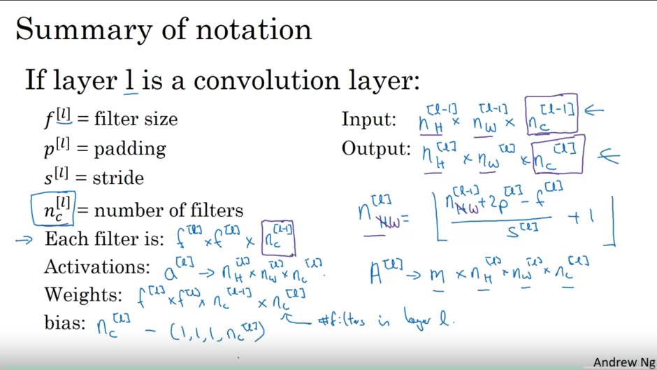
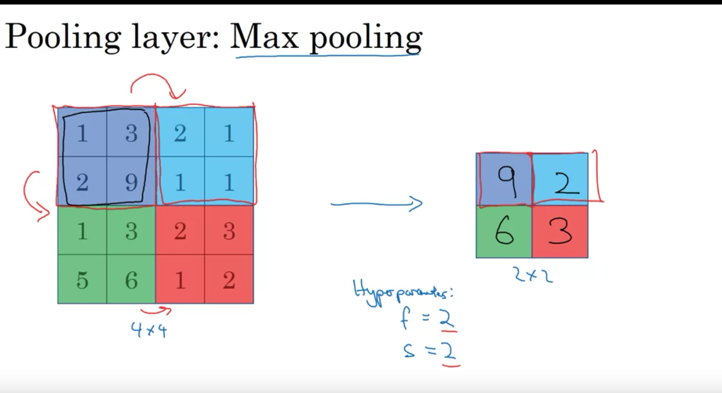
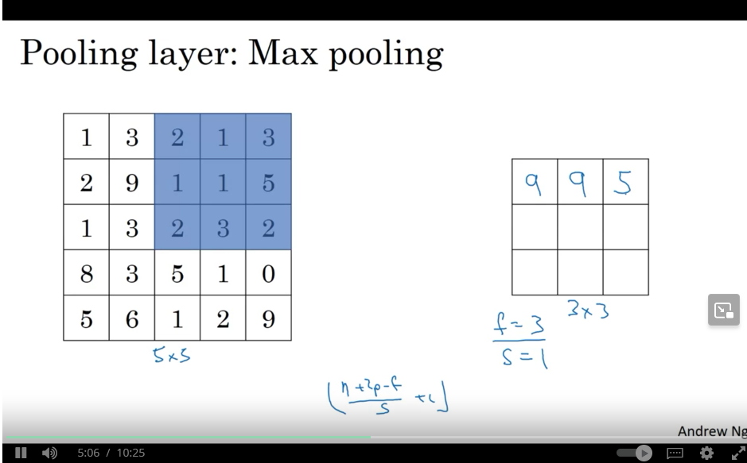
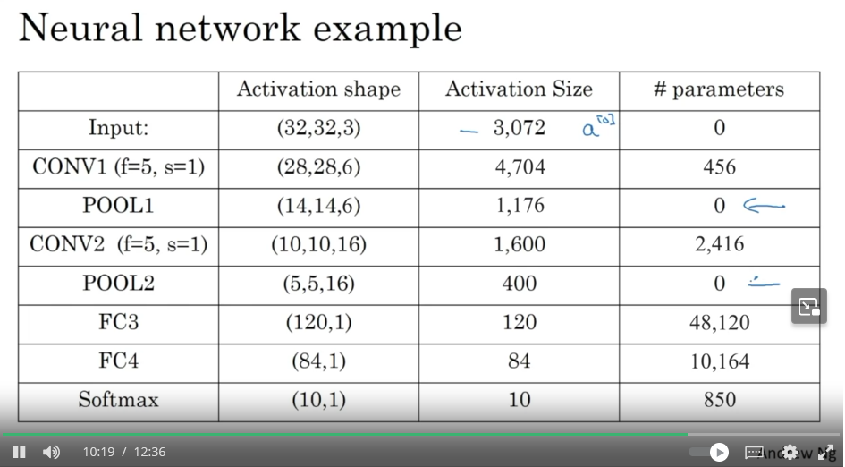
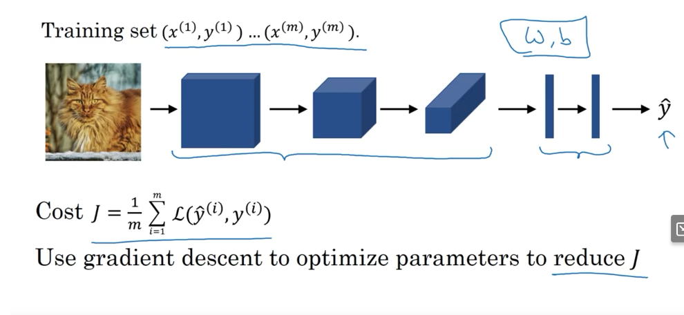

### Week 1 Course 4 of Deep Learning Specialization
#### Computer Vision
- Computer Vision has been progressing rapidly because of deep learning.
#### Computer Vision Problems
- Image Classification
  - Cat ??
- Object Detection
  - Where in the picture is there an object?
- Neural Style Transfer
  - Want a picture you already have painted in a different style
#### Deep Learning on large images
- Images can get really big.
- Example: 1000 * 1000 * 3 = 3 million parameter neural network.
  - 1000 * 1000 pixels with a 3 channels for rgb.
- This problem can be solved with convolutional neural networks.
#### Edge Detection Example
- First layer may detect vertical edges and horizontal edges.
#### Vertical edge detection
- When you have a image with the rgb values as a matrix you can multiply it by a filter matrix. This is the "convolution" operation(the multiplication)
- You are sliding the filter across the image matrix 1 to the left until the end. then you shift it one down and start over again.
- The convolution operation is probably explicitedly defined in the programming language you are using.
#### More Edge Detection
- Recap of previous section convolution operation allows us to detect the vertical edge.
- The convolution assumes the dark, light, grey part of the image. This is the 3x3 vertical edge detection filter.
#### Learning to detect edges
- There are other filters out there other than the horizontal and vertical filter. There is the Sobel filter and the Scharr Filter.
- Maybe you do not need to pick out the filter matrix but rather you can have the ML algorithm learn it.
- Neural Networks are able to learn the filter more robustly then humans can build.
- its a 3x3 filter matrix. The idea that the neural network can learn this is transformative.

#### Padding
- If you take a 6x6 matrix and convolve it with a 3x3 filter it will output a 4x4 matrix.
  - Math: 6x6= nxn, n-f+1 x n - f + 1 = 6-3+1 = 4x4
  - This is how many times the 3x3 matrix can fit into the 6x6 matrix.
  - Shrinks output
    - Shows why you do not want to convolve on every layer because it will shrink the image too much.
    - The way to fix this is to pad the image.
      - say like an additional border of one px around the image.
- The math above becomes this with padding: n + 2p - f + 1.

#### Valid and Same convolutions
- In terms of how to pad.
- "Valid": means no padding
  - nxn * fxf -> n-f+1 * n-f+1
- "Same": pad so that output size is the same as the input size.
  - n + 2p - f + 1 *  n + 2p - f + 1
  - p = (f-1)/2
  - 3x3, p = (3-1)/2 = 1
  - f is usually odd
    - You rarely see even numbered filters in computer vision.
      -  1. If f is even then you will get some asymmetric pattern
      -  2. An odd dimension filter has a central position.

#### Strided Convolutions
- stride = 2 means you will move 2 spaces when moving around the convolutional filter on the input matrix instead of 1 like we used to do. 1 is the default I guess
  - math
    - $\dfrac{n+2p-f}{s} + 1 \times \dfrac{n+2p-f}{s}$ + 1
      - We floor this if this fraction is not an integer.
  - Why?
#### Summary of convolutions
#### Technical note on cross-correlation vs. convolution
- Convolution in math textbook:
  - We flip the filter before convolving by mirroring it along the horizontal and vertical axis.
  - We skip this mirroring operation
    - So really our operation is called **cross correlation**, but in machine learning most of the time this operation is called the convolution operator.
#### Convolutions over volumes
#### Convolutions on RGB
- Instead of 6x6 image you may get a 6x6x3 image.
- first 6 is height, next 6 is width, 3 is # of channels
- number of channels in input must equal number of channels in filter
- a filter to use here may be 3x3x3
- a 6x6x3 image with a 3x3x3 filter will equal a 2d 4x4 result
  - Why does it reduce a dimension?
#### Multiple filters
- You can use a filter to detect a horizontal edge and a vertical edge
- gfor example of on a 6x6x3 with two 3x3x3 filters you can end up with a 4x4x2 result. The 2 being the two results for the matrix.
- Math: n * n * n_c * f * f * n_c = n-f+1 * n-f+1 * n_c

#### One layer of a cnn
#### Example of a layer
- You can use two different filters on a input matrix to get the 3d output when using a 3 dimensional input to a 3 dimensional filter
- You can apply a non linearity after the filter and add a bias to it.
- The input matrix can be seen as a[0] the filters as w[1] and then there is the bias added to the result of the nonlinearity.
  - The output would be a[1]
- 10 filters means the third dimension of output would be 10

#### Number of paramters in one layer
- If you have 10 filters that are 3x3x3 in one layer of a neural network, how many parameters does that layer have?
  - What is this asking exactly?
  - 3x3x3 = 27 parameters + bias = 28.
    - Then there are 10 filters so 28 * 10 = 280 parameters

#### Summary of notation
- If layer 1 is a convolutional layer
- f^[l] = filter size
- p^[l] = padding
- s^[l] = stride
- Input: n_h^[l-1] * n_w^[l-1] * n_c[l-1]
- Output: n_h^[l] * n_w^[l] * n_c[l]
- |_ n_h(w)^[l] = n_h(w)^[l-1] + 2p^[l] * -f^[l] / s^[l] + 1 _|
- 

#### Simple Convolutional Network Example
- Increasing the stride decreases the size of the output faster.
  - That makes sense intuitively
- 
  - Look at this for example calculations
- You can have a logistic regression or softmax layer at the end
#### Types of layer in a convolutional network:
- Convolution (CONV)
- Pooling (POOL)
- Fully connected (FC)
- The last two layers are simpler to define than CONV layer.
#### Pooling layers
#### Pooling layer: Max pooling
- 4x4 input take the max of 4 regions and end up with a 2x2 matrix
  - You choose the max over each two by two region in the 4x4 matrix
  - Hyperparamters: filter = 2 (Because you are applying it on 2x2 regions), stride = 2 (you are stepping two steps to get to the next region)
  - 
  - Intuition: the large number may be a important feature and it makes perserved.
  - The main reason for using max pooling is that it has been found to work well but no one really knows the underlying reason why its working so well.
  - For max pooling there is no parameters for gradient descent to learn
- Another example
  - We got a formula to figure out the size of the output layer in the previous sections
  - 
  - If you have multiple channels you do max pooling on each channel and aggregate the results therefore the channel dimension is perserved in the output dimensions
  - 5x5x2 => 3x3x2
    - f = 3, s = 1
- Max pooling is used much more than average pooling
#### Summary of pooling
- Hyperparameters:
  - f: filter size. f=2, s=2 or f-3, s=2 are common
  - s: stride
  - max or average pooling
  - padding is usually not used.
#### CNN Example
#### Neural Network Example
- 32 x 32 x 3
- (LeNet-5) popular network invented by Yann LeCunn
- Usually a layer is considered as conv and pool. But these two can be considered as separate layers.
- 
  - Try and figure this out

#### Why Convolutions?
- Finally I can understand why I am learning all this crap.
- 32 x 32 x 3 image -> f=5(means 5x5 filter) with 6 filters -> output: 28 x 28 x 6
- 32 * 32 * 3 = 3072 and 28 * 28 * 6 = 4704 -> 3072 * 4704 = ... a lot of parameters
- CNNs have realtively few parameters because of **parameter sharing**
  - A feature detector(such as a vertical edge detector) that's useful in one part of the image is probably useful in another part of the image.
- Another way is **sparsity of connections**: in each layer each output value only depends on a small number of inputs
  - For example 0s in the inputs do not contribute to the output
- Translation invariance - if the picture translates or shifts a few pixels it can still classify it correctly
#### Putting it together
- 

#### Quiz
- Quiz question hint: If you have 10 filters that are 3 x 3 x 3 in one layer of a neural network, how many parameters does that layer have?
  - 3 * 3 * 3 = 27 parameters + 1 for bias = 28 parameters
  - 28 parameters * 10 = 280 parameters in total
- Which of the following are hyperparameters of the pooling layer?
  - I guess **number of filters** is determined by stride which is one of the hyperparameters of the pooling layer.
- So apparently the architecture of a CNN makes it possible to be trained with less training sets.
  - **Answer**: Weight sharing significantly reduces the number of parameters in a neural network, and sparsity of connections allows us to use a smaller number of inputs thus reducing even further the number of parameters