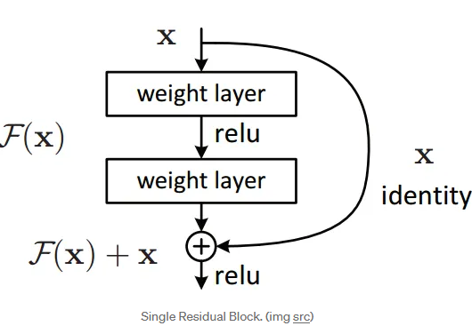

### Week 2 Deep Learning Course 4
#### Why look at case studies?
- One way to get better at building neural networks is to look at examples.
- After the next few videos you will be able to look at computer vision papers and be able to understand them.
#### Outline
- Classic Networks (How were these determined to be classic?)
  - LeNet-5
  - AlexNet
  - VGG
- ResNet (152 layer neural network)
  - Some tricks on how to build large scale neural networks
#### Classic Networks
- LeNet - 5 [paper link here]
  - Goal was to recognize hand written digits.
  - How do we go from a 32 x 32 x 1 image to a 28 x 28 x 6 output if the filter size is 5 x 5 and there are 6 filters ?
  - 
  - 
  - ^ I know the formulas but how does this work? The image gets reduced in size because that is how the convolutional operation works. See below.
  - 
    - We are using the filter to do the convolutional operation. The filter is being sliden across the image then we are doing a matrix mutliplication with that part of the image and the filter contents. Its the rules of matrix multiplication that is the driving force behind the reduction of the image.
- **Advanced Details** on paper
  - 1. People were not using ReLU back then.
  - 2. Something
  - 3. This neural network had a nonlinearity after the pooling layer.
  - This is one of the harder papers. Focus on reading section 2 and some of section 3.
- AlexNet [paper link here]
  - Had a lot of similarities to LeNet but was much bigger.
  - Also used ReLU
  - **Advanced Details**:
  - Trained on multiple GPUs
  - Local Respose Normalization (not used much)
    - Motivation for this is at each position it will normalize the image across the channels so that there are not too many neurons with a high activation.
    - So that there are not too many neurons with a high activation at each position
    - Researchers have found that this does not help much.
  - This is the paper that really introduced deep learning to computer vision
  - This is a good paper to start with looking at.
- VGG - 16 [paper link here]
  - Its a much simpler network with less hyperparameters.
  - CONV = 3x3 filter, s = 1, same
  - MAX-POOL = 2x2, s = 2
  - The simplicity of this architecture made it appealing even though its quite large even by modern (2020) standards
- Architectures of these classic neural networks visualized:
  - This will help me to understand the papers
  - LeNet - 5
  - 
  - AlexNet
  - 
  - VGG - 16
  - 
- These networks are classic because now there are even more powerful networks.
#### ResNets
- Very very deep neural networks are hard to train because of vanishing and exploding gradients problem.
- ResNet aims to solve that problem.
#### Residual block
- WTF is this shit?
- Supplemental Resource Notes below [https://towardsdatascience.com/residual-blocks-building-blocks-of-resnet-fd90ca15d6ec]:
- In a traditional neural network each layer feeds onto the next layer.
- In a network with residual blocks, each layer feeds into the next layer *and* directly into layers about 2-3 hops away.
- 
  - Single Residual Block
- Neural networks are **universal function approximators** and the accuracy increases with the number of layers. (I think I know what this is saying. Its trying to find a function that fits every problem and the number of layers is important because???)
- there is a limit to the number of layers that can be added though because of the vanishing and exploding gradients problem and the curse of dimensionality (which was???)
  - Curse of Dimensionality is a set of problems related to the high dimensionality of data. I cannot think of the intuition for any at the moment.
- The degration problem:
  - Shallower networks train better than deep ones because for the deep networks we will see that the accuracy will saturate at one point and eventually degrade. And this is usuaully not caused due to overfitting!!
    - So why not skip these extra layers and match the accuracy of the shallow sub-networks. But how?
    - We can learn the identity function by skipping layers that is why there is a identity on the *Single Residual Block* image
    - **Stopped at trying to understand the Residual Block**
### Homework
- Read the AlexNet paper [https://paperswithcode.com/method/alexnet]