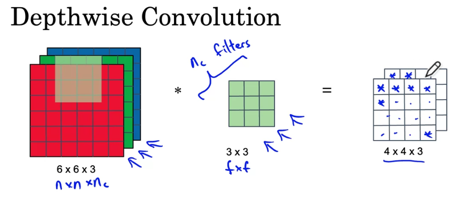

### Week 2 Deep Learning Course 4
#### Why look at case studies?
- One way to get better at building neural networks is to look at examples.
- After the next few videos you will be able to look at computer vision papers and be able to understand them.
#### Outline
- Classic Networks (How were these determined to be classic?)
  - LeNet-5
  - AlexNet
  - VGG
- ResNet (152 layer neural network)
  - Some tricks on how to build large scale neural networks
#### Classic Networks
- LeNet - 5 [paper link here]
  - Goal was to recognize hand written digits.
  - How do we go from a 32 x 32 x 1 image to a 28 x 28 x 6 output if the filter size is 5 x 5 and there are 6 filters ?
  - 
  - 
  - ^ I know the formulas but how does this work? The image gets reduced in size because that is how the convolutional operation works. See below.
  - 
    - We are using the filter to do the convolutional operation. The filter is being sliden across the image then we are doing a matrix mutliplication with that part of the image and the filter contents. Its the rules of matrix multiplication that is the driving force behind the reduction of the image.
- **Advanced Details** on paper
  - 1. People were not using ReLU back then.
  - 2. Something
  - 3. This neural network had a nonlinearity after the pooling layer.
  - This is one of the harder papers. Focus on reading section 2 and some of section 3.
- AlexNet [paper link here]
  - Had a lot of similarities to LeNet but was much bigger.
  - Also used ReLU
  - **Advanced Details**:
  - Trained on multiple GPUs
  - Local Respose Normalization (not used much)
    - Motivation for this is at each position it will normalize the image across the channels so that there are not too many neurons with a high activation.
    - So that there are not too many neurons with a high activation at each position
    - Researchers have found that this does not help much.
  - This is the paper that really introduced deep learning to computer vision
  - This is a good paper to start with looking at.
- VGG - 16 [paper link here]
  - Its a much simpler network with less hyperparameters.
  - CONV = 3x3 filter, s = 1, same
  - MAX-POOL = 2x2, s = 2
  - The simplicity of this architecture made it appealing even though its quite large even by modern (2020) standards
- Architectures of these classic neural networks visualized:
  - This will help me to understand the papers
  - LeNet - 5
  - 
  - AlexNet
  - 
  - VGG - 16
  - 
- These networks are classic because now there are even more powerful networks.
#### ResNets
- Very very deep neural networks are hard to train because of vanishing and exploding gradients problem.
- ResNet aims to solve that problem.
#### Residual block
- WTF is this shit?
- Residual blocks have mutliple residual skip connections
- 
- Supplemental Resource Notes below [https://towardsdatascience.com/residual-blocks-building-blocks-of-resnet-fd90ca15d6ec]:
- In a traditional neural network each layer feeds onto the next layer.
- In a network with residual blocks, each layer feeds into the next layer *and* directly into layers about 2-3 hops away.
- With a resnet you can have the training error go down as the number of layers go up. I need to understand why this works.
- 
  - Single Residual Block
- Neural networks are **universal function approximators** and the accuracy increases with the number of layers. (I think I know what this is saying. Its trying to find a function that fits every problem and the number of layers is important because???)
- there is a limit to the number of layers that can be added though because of the vanishing and exploding gradients problem and the curse of dimensionality (which was???)
  - Curse of Dimensionality is a set of problems related to the high dimensionality of data. I cannot think of the intuition for any at the moment.
- The degration problem:
  - Shallower networks train better than deep ones because for the deep networks we will see that the accuracy will saturate at one point and eventually degrade. And this is usuaully not caused due to overfitting!!
    - So why not skip these extra layers and match the accuracy of the shallow sub-networks. But how?
    - We can learn the identity function by skipping layers that is why there is a identity on the *Single Residual Block* image
    - **Stopped at trying to understand the Residual Block**
#### Why ResNets work?
- 
  - This explains where the ResNet will find the identity function. If W^[l+1] = 0 it just returns a^l
  - You can have a weight in front of the a^[l] we are passing in the residual connection. This will be a matrix mult.
- Very deep networks have struggles learning the identity function. Since ResNets help performance then that means that it should be able to not hurt performance.
#### Networks in networks and 1x1 Convolutions
#### What does a 1x1 convolution do?
- 
  - The top 1x1 convolution does nothing but the bottom one is good.
  - The bottom thing is whats called a network in network convolution.
#### Using 1x1 Convolutions
- What if the number of channels has gotten too big and you want to shrink.
- 
- 1. Can help add or reduce the number of channels in a network
- 2. Can be used to add a nonlinearity to the CNN
### Inception Network Motivation
- You can use whatever filter sizes, pooling layers, and just concatenate the outputs and have the network choose the ordering of it?
#### The problem of computational cost
- 
  - Without 1x1 convolutions this will take a 120M multiplies.
#### Using 1x1 convolution
- 
- This will only use a 12.4M multiplies.
- Shrinking down the neural network does not seem to hurt the performance (the bottleneck layer)
#### Inception Network
#### Inception Module
- 
- So there is some side branchs
- 
  - The side branches are being used to make a prediction to make sure that the hidden layers are being trained reasonably.
- Inception Networks are called GoogleNet to pay homage to the LeNet.
- If you understand the inception module then you can understand the inception network. The inception network is basically the inception module repeated.
### MobileNet
- Some practical advice on buildng these kinds of neural networks
#### Motivation for MobileNets
- Low computation cost at deployment
- This is useful for mobile phones.
- Depth-wise separable convolutions are beneficial here.
#### Normal Convolution

#### Depthwise Separable Convolution
- There is a 2 steps
- 1. There is a depthwise convolution
- 2. Then there is a pointwise convolution
- 
- Now lets flesh this out!
#### Depthwise Convolution
- 
#### Pointwise Convolution
- 
#### Cost Analysis

#### MobileNet Architecture
- Everywhere you would have used a normal convolution you can now use a depthwise and pointwise convolution.
- 
- We renamed pointwise convolution to Projection for reasons that we will learn about soon.
#### MobileNet v2 Bottleneck
- 
- We are projecting down from a nxnx18 to a nxnx3 therefore the pointwise convolution is called a projection.
- The mobile bottle neck layer will be repeated 17 times
#### EfficientNet
- You want to adjust to different edge networks scaling up or down based on the amount of resources available to you.
- 
### Practival Advice for using ConvNets
#### Using open-source implementations
- A lot of these neural networks are difficult to replicate based on only reading the paper.
- Look online for an open source implementation of the paper it can help speed up progress/
  - This is probably what I would do first before trying to implement a paper from scratch.
#### Transfer Learning
- You can download weights that someone else has used on a architecture. They have probably trained with lots of resources and time to build this network. They have done the hyperparameter tuning already.
- You can freeze to only train softmax layers weights but freeze the other layer's weights
  - 
- You can save to disk and then train a softmax classifier on top of that.
### Data Augmentation
- You need more data
#### Common  Augmentation Method
- Mirroring
- Random Cropping
  - In practice it works well.
#### Color Shifting
- RGB
- Sometimes called "PCA color" augmentation
- This was talked about in the AlexNet Paper.
#### Implementing Distortions During Training
- You have a stream of images coming from the hard disk. You can use a CPU thread to do the distortion to the image. Then the image is passed to some other thread to do training.
- Use someone else's open source implementation to get started for data augmentation. If there is some variation that hasn't been done before then you may need to tune these hyperparameters yourself.
### State of Computer Vision
#### Data vs. Hand-Engineering
- <--- Little Data ------ Image Recognition --------- Lots of Data --->
- 
- We just don't have enough data for computer vision.
- Transfer of Learning helps a lot when there is little data
#### Tips for doing well on benchmarks/winning competitions
- Ensembling
  - Train serval networks independently and average their outputs.
  - Not used in production but used mainly for benchmarks
- Multi-crop at test time
  - Same thing like ensembling. This is primarily used for benchmarks.
#### Use open source code
- Use architectures of networks published in the literature.
- Use open source implementations if possible
- Use pretrained models and fine tune them on your dataset.
### Quiz for this week
- I got a 60% on the first quiz. And I had to use chat gpt for one of the questions on MobileV2. This sucks ;|
1. What is the use of 1x1 layers?
   - A 1x1 layers makes a sum over the depth of the volume (how its two dimensional??? Depth is the third dimension)
2. In order to be able to build very deep networks, we usually only use pooling layers to downsize the height/width of the activation volumes while convolutions are used with "valid" padding. Otherwise, we would downsize the input of the model too quickly.
   - **True** is not the right answer. (Hint: Be carefultwith the definition of "valid" padding)
3. Suppose that in a MobileNet v2 Bottleneck block we have an n x n x 5 input volume, we use 30 filters for the expansion, in the depthwise convolutions we use 3x3 filters, and 20 filters for the projection. How many parameters are used in the complete blockm suppose we don't use bias?
    - I am not sure how to do the calculation for this. Here is what chat gpt did:
    - 
    - The ordering of the layers are 1. Expansion, 2. Depthwise, 3. Pointwise.
    - Expansion Layer: The layer uses 1x1 convolutions to expand the input volume. In our case the input volume is n x n x 5 and we use 30 filters. So the number of parameters for this layer is 1 x 1 x 5 x 30 = 150 parameters
    - Depthwise Convolution: Each filter gets applied to the input channel one at a time.
      - 
      - So it us 3x3x30 because the expanded layer has a depth of 30 and it gets applied to each channel separately.
      - 3x3x30 = 270 parameters
    - Projection layer: It convolves the input with a 1x1xdepth_of_input then the filter size is 20 filters for the projection so that adds the 20 to the end of this resulting in 1x1xdepth_of_inputx20 => 1x1x30x20 = 600
    - In total its 600 + 270 + 150 = 1020 parameters
### Week 2 Project
- Have ResNet blocks helps with the skip connections helps some blocks learn the identity function which means that its not possible for this to harm the training performance of the neural network.
  - There is some evidence that the ease of learning the identity function accounts for more of the ResNet's remarkable performance even more so than the skip connections help solving the vanishing gradient problem.
- Two main types of blocks are used with the ResNet depending on whether the input or output dimensions are different.
    1. Identity Block
    2. Convolutional Block.
#### Identity Block
- The identity block is the standard block in the ResNet and corresponds to the case when (a^[l]) the input activation has the same dimensions as the output activation (a^[l+1])
- We are implementing a powerful version of this block that skips over 3 layers.
- 
- What is "valid" padding?
  - n x n * f x f -> n - f + 1 x n - f + 1
  - 6x6 * 3x3 -> 4x4
- What is "same" padding?
  - pad so output size is the same as the input size
#### Convolutional Block
- This is the second block type used with ResNets. We use it when the input and output dimensions do not match up.
- The difference with the identity block is that there is a CONV2D layer in the shortcut path.
- 
- the CONV2D layer in the shortcut path is used to resize the input x to a different dimension, so that the dimensions match up in the final addition needed to add the shortcut back to the main path. (This plays a similar role as the matrix W_s discussed in lecture)
  - What the hell is W_s?
- For example, to reduce the activation dimension's height and width by a factor of 2, you can use a 1x1 convolution with a stride of 2.
#### Building Your First ResNet Model
- 
- I like this doing this project because getting dirty with the code helps me gain a feel for the architecture that I am working with and its not possible to make a lot of mistakes because most of the code is written for me.
### Transfer Learning With MobileNet Project #2
- What are bottleneck layers?
- What are all these?
  - Conv2D and DepthwiseConv2D
  - Expansion
  - Depthwise Convolution
  - Projection
- **What I should remember**:
  - MobileNetV2's unique features are:
    - Depthwise separable convolutions that provide lightweight feature filtering and creation
    - Input and output bottlenecks that preserve important information on either end of the block
  - Depthwise separable convolutions deal with both spatial and depth (number of channels) dimensions.
- 
  - We are going to delete from the top layer (classification layer) because this layer contains all of the classification labels and we are going to create a new classification layer.
  - Because the base model has predicted our llama and not llamas so wrong
  - 
#### Fine Tuning
- so since we are not getting exceptional results we are going to try to fine tune the model.
- Unfreeze the last couple of layers and it should help you adapt to the higher level features of your data. Like pointy ears, fur etc. The intuition is that the low level features of the image should be the same across the board.
- Where the final layers actually begin is kind of arbitrary.
- **What I should remeber**:
- To adapt the layer to new data I need to delete the "top" layer and add a new classification layer and train only on that layer.
  - What is the "top" layer?
  - 
- When freezing layers avoid keeping track of statistics (like in the batch norm layer)
- Fine-tune the final layers of your model to capture high-level details near the end of the network and potentially improve accuracy.
### Homework
- ~~Read the AlexNet paper [https://paperswithcode.com/method/alexnet]~~
- Read the other papers if you get a chance. Go to LeNet-5 next. Then go down in the order that we learned them.
- This has been one of the most confusing weeks of this whole course. Hopefully everything is as simple as Andrew Ng has laid out in these videos and I just have to deepen my understanding of things by diving into these papers. Start with the paper he said is the easiest to get into and build momentum from there that is my strategy.