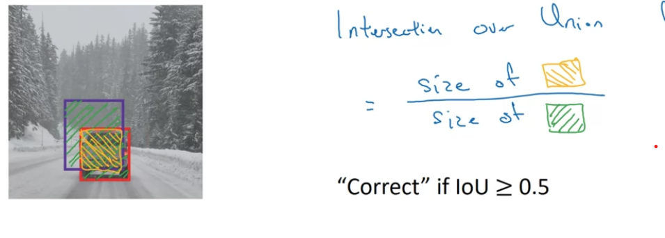
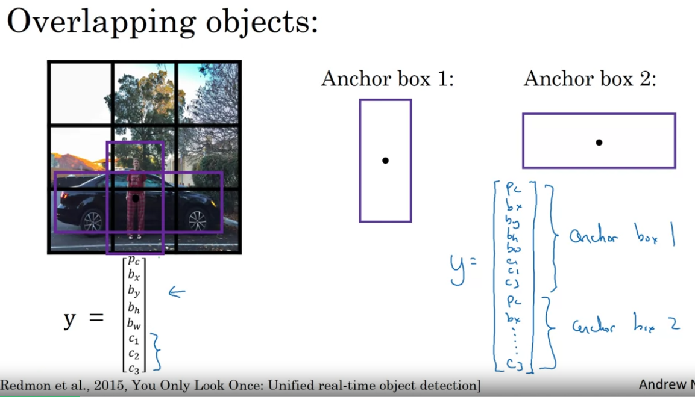
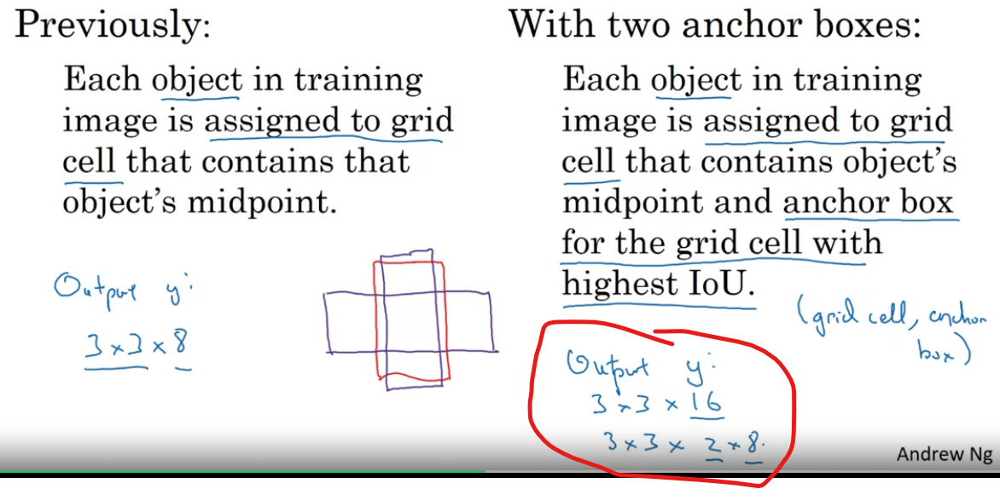

### Week3 Deep Learning Course #4
- Apply CNNs to the hottest and (most challenging) field in computer vision: object detection.
- Objectives:
- Identify the components used for object detection (landmark, anchor, bounding box, grid,...) and their purpose
- Implement object detection
- Implement non-max suppression to increase accuracy
- Implement intersection over union
- Handle bounding boxes, a type of image annotation popular in deep learning.
- Apply sparse categorical crossentropy for pixelwise prediction.
- Implement semantic image segmetation on the CARLA self-driving car dataset
- Explain the difference between a regular CNN and a U-net
- Build a U-net
#### Object Localization
- Image classification (1 Object)
- What are localization and detection?
- Localization: Where in the image is the object (1 object)
- Detection: What is the object detected. (multiple objects)
- You can have a CNN output 4 parameters (b_x, b_y, b_h, b_w) and these are the parameters of the bounded box. 
- 
  - P_c is saying whether an image was detected in the image or not.
  - Then the 3 spaces at the end are for detecting if it was a perdesterian, car, or motorcycle
  - We mostly care about how well the network is predicting the first space which is P_c
#### Landmark Detection
- In general cases you can have the neural network generate x and y coordinates which are the landmarks of some stuff you wanted the neural network to detect.
- What are landmarks? 
- As opposed to a bounded box as shown on the left. The neural network detects points in a image as shown on right.
- You can detect as many landmarks as you want!
- Someone will have had to go through a laboriously generate all of these landmarks.
### Object Detection
- Use the building blocks from the previous sections
- Sliding windows detection algorithm
#### Sliding Windows Detection
- You slide a bounded box across the whole image. Going through every region of the image to detect a object. 
- There is a huge disadvantage to this which is the computational cost.
  - Increasing the stride can improve cost but reduce the performance.
- The sliding windows can be implemented much more efficiently. Which we will see in the next video/section
### Convolutional Implementation of Sliding Windows
#### Turning FC layer into convolutional layers
- 
- You do this conversion by adding filters.
- On the bottom half of the image those are not FC layers but the places where the FC layers were converted into convolutional layers.
#### Convolution implementation of sliding windows
-  This method shares the computation in the areas of the image where there is overlap. As you can see there are four possible sliding windows in the whole image (color coded)
- Is this basically compression?
- This algorithm has one problem. the position of the bounded boxes are not going to be too accurate
### Bounding Box Predictions
#### YOLO Algorithm
- You Only Look Once
- 
- P_c is only assigned on the grid where the center of the image lies
- 
- For each of these 3x3 grid cells there is a corresponding 8 dimensional vector.
- This is a convolutional implementation. there is one shared computation for all of the 3x3 grid cells.
#### Specify the Bounding Boxes
- b_x, b_y, b_h, b_w are specified relative to the grid cell
- 
- In the next few videos he will show ideas that can make this algorithm even better.
- The YOLO paper is one of the harder papers to read. Even Andrew Ng had a hard time figuring out the details of this paper and had to ask fellow researcher friends
### Intersection over Union
#### Evaluating Object Localization
- IOU computes the intersection over union of the the two bounded boxes. Size of the intersection/size of the union
- 
- the "correct" IOU is just the convention. There is no deep scientific reasoning for it.
- Generally, IoU is a measure of the overlap of two bounding boxes.
### Non-max Suppression
- Makes sure that the algorithm detects the object only once.
- Problem: 
  - All of the boxes think they have correctly identified the image, but it has done the classification too many times. How would I fix this?
  - 
  - Highest probability is highlighted and the others are suppressed.\
#### Non-max suppression algorithm
- Its very specific you can review the slide to understand it. Nothing much to be learned here.
- One last idea left to make the algorithm better
### Anchor Boxes
#### Overlapping objects
- Midpoint of two images overlap in a grid.
- How do you pick what image it is in that grid?
- 
#### Anchor box algorithm
- Previously: Each object in training image is assigned to grid cell that contains that object's midpoint
- With two anchor boxes:
  - Each object in training image is assigned to grid cell that contains object's midpoint and anchor box for the grid cell with highest IoU.
  - 
- What if there is 2 anchor boxes but 3 objects overlapping in one cell. That is a case that this algorithm will not handle well.
- The anchor box is chosen by people. Or you can use machine learnign to choose a anchor box that will generalize to the object that you are trying to detect.
#### Putting it all together into the YOLO Algorithm
- It just goes through an example of the algorithm running on a image.
- After everything you output the non-max suppressed outputs.
### Region Proposals (Optional)
- Its optional because Andrew Ng uses this id less often
#### Region proposal : R-CNN
- Regions with CNN = R-CNN
  - Select just a few windows and run your CNNs on it.
  - A segmentation algorithm is run on the image to see where a image would be. The machine learning algorithm looks at blobs of images and some of them could be objects.
#### Faster Algorithms (than R-CNN)
- R-CNN is quite slow
- R-CNN: Propose regions. Classify proposed regions one at a time. Output label + bounding box.
- Fast R-CNN: Propose regions. Use convolutions implemention of sliding windows to classify all the proposed regions
- Faster R-CNN: Use convolitional network to propose regions.
- Andrew Ng's opinion: Not having two steps seems to be the more promising direction for Computer Vision.
### Semantic Segmentation with U-Net
#### Object Detection vs. Semantic Segmentation
- 
  - "Is this road a drivable surface?" represented in the green area
#### Motivation for U-Net
- 
  - Tumor detection
  - X ray determination
#### Per-pixel class labels
- You can have 1 for each pixel in the one class and 2 for each pixel in the 2 class.
- 
#### Deep learning for Semantic Segmentation
- 
  - Transpose convolution is what is used to make this image bigger
### Transpose Convolution
- 
- This is how the 2x2 matrix gets expanded to a 4x4
### U-Net Architecture Intuition
- 
  - The skip connection is there because it needs the contextual information of where the cat could be (circled in red) and the detailed spacial dimensions which comes from the beginning. At the beginning its higher resolution the height and width is larger.
### U-Net Architecture
- 
- 
  - For every one of the **h X w** pixels how likely is it to be one of the n_classes
### Quiz
1. Distinction between semantic segmentation and localization. **Localization** deals with where in the image is the object. **Semantic Segmentation** we need to classify each pixel from the image. So not a crazy distinction but its a distinction that the quiz makes.
2. Recall that IoU is calculated as the quotient of the area of the intersection over the area of the union and that the area of the union is not the sum of the areas. If **union** is not the sum of the areas then what is it because it can not be the intersection.
  - **Union**: Oh I see. So the union is the area of the two boxes - the area of intersection. Since we only want to account for that area once.
3. I said the output was (2N, 1) for a neural network that outputs N landmarks on the face. But we use column vectors and not row vectors for the output. So the answer would be (1, 2N). But why do we use column vectors and how did I miss this?
4. To train a localization model we **need** the presence of bounding boxes **in the training set**.
### Project YOLO Algorithm: Autonomous Driving Application Car Detection
- If there are 80 classes you want the object detector to recognize, you can represent the class label *c* as an integer from 1 to 80, or as an 80-dimensional vector(with 80 numbers).
  - I thought the 1-80 representation was bad because of the curse of dimensionality problem. In this project we are going to be using both representations **depending on which is more convenient for a particular step**
  - ^ I think I am starting to understand the fundamentals of how machine learning is practiced as of today.
- The YOLO model is very computationally expensive to train so we are provided with the pretrained weights.
- **What I should Remember from the YOLO project**:
  - YOLO is a state-of-the-art object detection model that is fast and accurate (for its time I bet there are faster and more accurate models out now)
  - It runs an input image through a CNN, which outputs a 19x19x5x85 dimensional volume.
  - The encoding can be seen as a grid where each of the 19x19 cells contains information about 5 boxes.
  - You filter through all the boxes using non-max suppression. Specifically:
    - Score thresholding on the probability on the probability of detecting a class to keep only accurate (high probability) boxes.
    - Intersection over Union (IoU) thresholding to eliminate overlapping boxes
  - Because training a YOLO model from randomly initialized weights is non-trivial and requires a large dataset as well as a lot of computation. They provided the trained model parameters for us.
  - I can try to fine tune the model on my own dataset but it would be a non-trivial exercise.