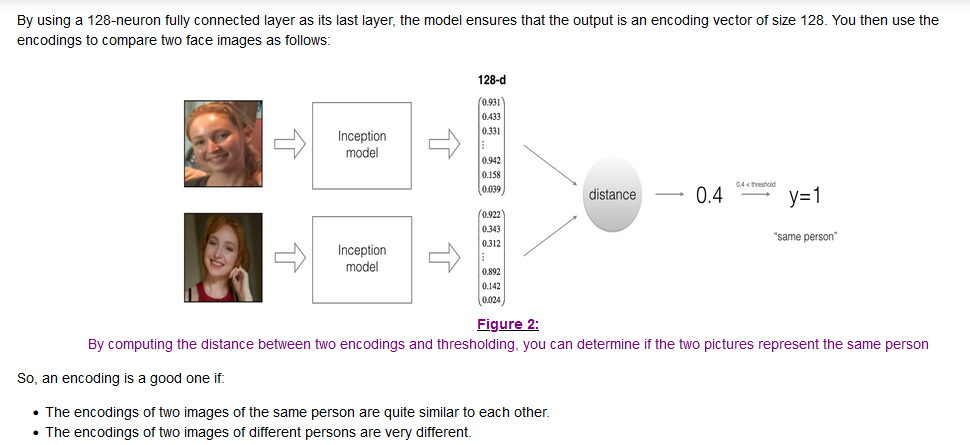
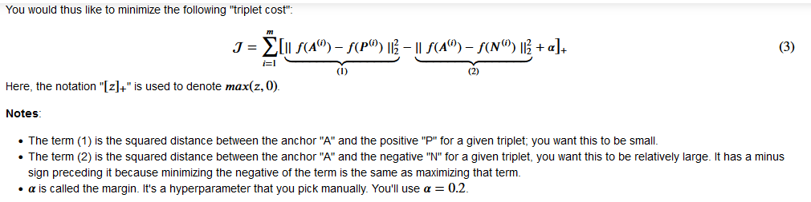
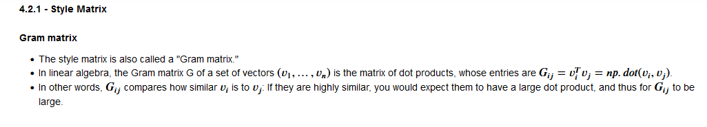

### Week 4 started on 12/12/2023
#### Learning Objectives
- **Main** Explore how CNNs can be applied to multiple fields, including art generation and face recognition, then implement your own algorithm to generate art and recognize faces.
- Differentiate between face recognition and face verification
- Implement one-shot learning to solve a face recognition problem.
- Apply the triplet loss function to learn a network's parameters in the context of face recognition.
- Explain how to pose face recognition as binary classification problem.
- Map face images into 128-dimensional encodings using a pretrained model.
- Perform face verification and face recognition with these encodings
- Implement the Neural Style Transfer.
- General novel artistic images using Neural Style Transfer.
- Define the style cost function for Neural Style Transfer.
- Define the content cost function for Neural Style Transfer
### What is facial recognition?
- Face verification vs face recognition
  - recognition is much harder than verification.
- **Face Verification**: input image, name/ID.
  - Output whether the input image is that of the claimed person
- **Recognition**: has a database of K persons, get an input image, output ID if the image is any of the K persons (or "not recognized")
- Recognition is harder because there are K-1 chances of getting it wrong.
### One Shot Learning
- Learning from one example to recognize the person again.
- A small training is not good. What if a new person joins your team? You will have to retrain the neural network?
#### Learning a "similarity" functon
- d(img1, img2) = degree of difference between images
- If d(img1, img2) <= tao "same"
    else > tao "different"
- Learning this function d allows us to solve the one shot learning problem.
### Siamese Network
- How can I learn the function d? This is the problem that the Siamese Network solves.
- Pass in two images. We are running two different images on two identical conv nets and getting the encoding of the images out of them. Then we take the norm between the two encodings.
#### Goal of Learning
- Learn parameters so that if for the same person the norm is small and for different persons the norm is large.
### Triplet Loss
#### Learning Objective
- Anchor and positive images (both are of the same person)
- Anchor and negative (both images are of different people)
- Want the norm of the anchor and positive to be less than or equal to the norm of the anchor/negative images. 
### Loss Function
- Given 3 images A, P, N.
- L(A, P, N)
- 
#### Choosing the triplets A,P,N
- During training, if A, P, N are chosen randomly then d(A,P) + \alpha <= d(A,N). because A and N will have a lot of distance presumably.
- Choose triplets that're "hard" to train on.
- Next we will look at variations on "siamese networks" and how to train these systems.
### Face Verification and Binary Classification
#### learning the similarity function
- We are using just pairs of images
  - 1 is the images is for the same person
  - 0 is the images are for different people.
### What is Neural Style Transfer?
- You want a picture recreated in the style of an artist.
### What are deep ConvNets learning?
#### Visualizing what a deep network is learning
- Pick a unit in layer 1, Find the nine image patches that maximize the unit's activation.
- repeat for other hidden units.
#### Visualizing deep layers
- Deeper layers detect more complex features 
  - This is so cool.
- Now let's use this intuition to start building a neura; style transfer algorithm.
### Cost Function
#### Neural Style Transfer Cost Function
- J(G) = J_content(C, G) how similar is the content of C(the original image) to the generated image (G) 
  - alpha and beta may be redundant here.
#### Find the generated image G
1. Initiate G randomly
2. Use gradient descent to minimize J(G)
- Next we need to define a content cost function and style cost function.
### Content Cost Function
- 
### Style Cost Function
#### Meaning of the "style" of an image
- Say you are using layer l's activation to measure "style" Define style as correlation between activations across channels.
  - How correlated are the activations across different channels?
  - ^Why does this capture style?
- The style is the correlation between the activations across channels.
- How correlated are the activations across different channels?
  - Look across the same positions across different channels.
  - **Intuition** this answers how often a feature like stripes and the color yellow occur together.
#### Intuition about style of an image
- So we are comparing the correlation between the layers of a image and then comparing across to different images and looking at their activations' correlations as well?
  - Then we compare the two correlations?
#### Style matrix
- 
#### Style cost function
- 
### 1D And 3D Generalizations
- Conv nets can be used in 1D data. It can change the output size as it would for 2D data. 
- The 16 here comes from the 16 filters. This number will be given if I am ever asked a question about this. 
#### Quiz
- In neural style transfer, we train the pixels of an image, and not the parameters of a network.
  - True because neural style transfer compares the high-level features of two images and modifies the pixels of one of them in order to look artistic.
- One-shot learning refers to the amount of data we have to solve a task, not the number of forward passes.
#### Project 1 for Week 4 - Face Recognition
- Face verification: "Is this the claimed person?" For example, at some airports, you can pass through customs by letting a system scan your passport and then verifying that you (the person carrying the passport) are the correct person. An iphone that unlocks when it sees your face is also face verification
- Face recognition: Your face is compared against a data base of faces to see if you match any of the faces in the database.
- **Channels last notation**: the channels are the last dimension.
- **Naive Face Verification**: compare two image pixel-by-pixel if the distance between the raw images is below a certain threshold, it may be the same person. This algorithm performs poorly since the pixel values change dramatically due to variations in lighting, orientation of the person's face, minor changes in head position, and so on.
- Instead of using the raw image, you can learn an encoding *f(img)*
- By using an encoding for each image, an element wise comparison produces a more accurate judgement as to whether two pictures are of the same person. 
- Triplet Loss Function Intuition: 
  - Its squared so that it takes the difference without respect to if a term makes the difference positive or negative
  - You want to make the first term be small and the second term be large.
  - The negative sign is in front of the second term because?
    - "Minimizing the negative of the term is the same as maximizing that term" This still does not make sense to me.
    - It makes sense because we are minimizing the overall triplet cost with the two terms. And minimizing the negative means that its positive and we do want that second term to be large. So it makes sense. 
  - **What I should remember**:
    - Face verification solves an easier 1:1 matching problem. Face recognition addresses a 1:K matching problem.
    - **Triplet loss** is an effective loss function for training a neural network to learn an encoding of a face image.
    - The same encoding can be used for verification and recognition. Measuring distances between two images' encodings allows you to determine whether they are pictures of the same person.
  - **Ways to improve this result**:
    - Crop the images to contain just the face and less of the "border" region around the face. This preprocessing removes some of the irrelevant pixels around the face and also makes the algorithm more robust.
#### Project 2 - Deep Learning & Art: Neural Style Transfer
- Most of the algorithms I have studied optimize a cost function to get a set of parameter values neural style transfer will optimize a cost function to get a set of pixel values.
- The **shallower layers** of a ConvNet tend to detect lower-level features such as *edges* and *simple textures*.
- The **deep layers** of a ConvNet tend to detect higher-level features such as more *complex features* and *object classes*
- Choose a "middle" activation layer will get the best results because in practice it will most likely have those low level and high level features.
- The **Content Cost Function** basically looks at the activations in a layer.
- **What I should remember from this section**:
  - The content cost function takes a hidden layer activation of the neural network, and measures how different a^c and a^g are.
  - When I minimize the content cost function I am making sure that images C and G are similar.
- The **Style Cost Function** is represented by the correlation of gram matrices of the images C and G. Gram matrix also known as a style matrix is a concept from Linear Algebra 
- When we compute the style cost across layers (because unlike the content cost its better to merge the costs across layers for the style cost) we add coefficients to the layers.
  - The deeper layers capture higher-level concepts, and the features in the deeper layers are less *localized* relative to each other. (*localized*: to attribute to a particular locality. "sought to localize the origin of the rumor") If you want the generated image to softly follow the style image try choosing larger weights for deeper layers and smaller weights for the first layers.
- Neural Style Transfer is the first time in this course where we built a model in which the optimization algorithm updates the pixel values rather than the neural network's parameters.
- **What I should remember**:
  - Neural Style Transfer is an algorithm that given a content image C and a style image S can generate an artistic image.
  - It uses representations based on hidden layer activations of a pretrained ConvNet.
  - The content cost function is computed using one hidden layer's activations.
  - The style cost function for one layer is computed using the Gram matrix of that layer's activations. The overall style cost function is obtained using several hidden layers.
  - Optimizing the total cost function results in synthesizing new images