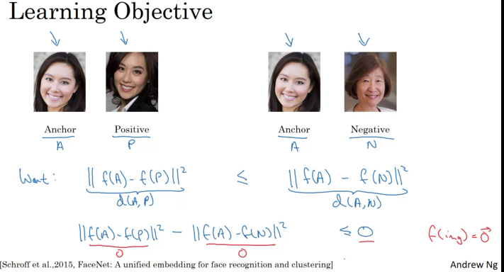
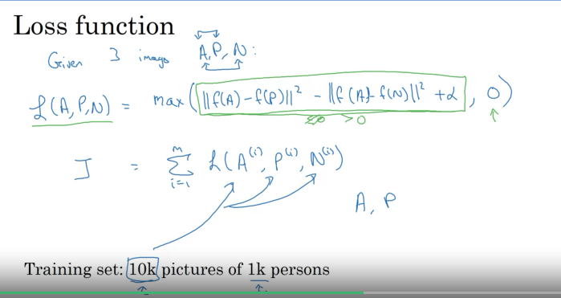
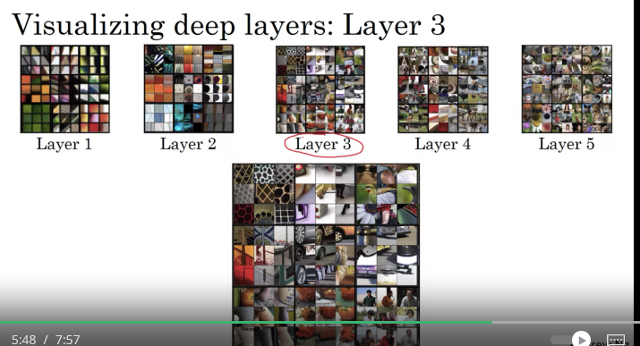
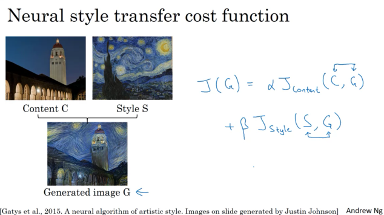
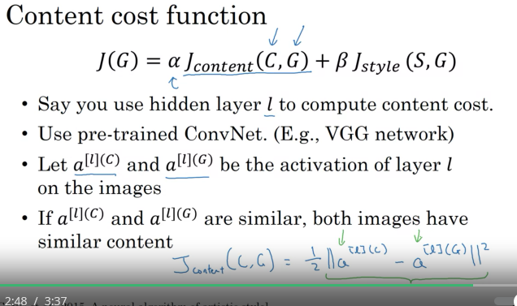
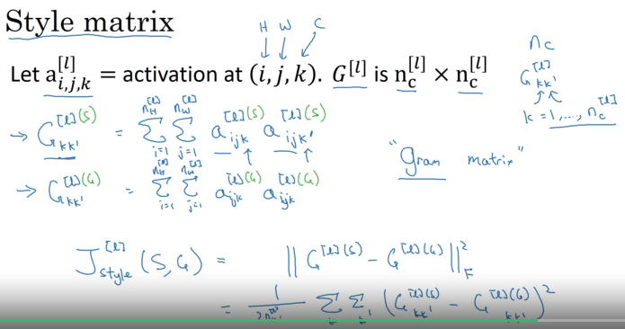
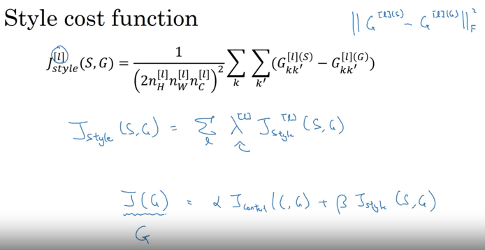
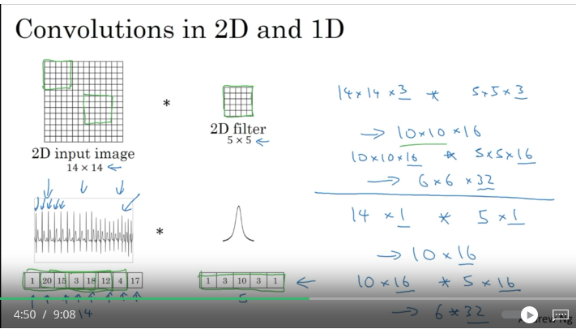
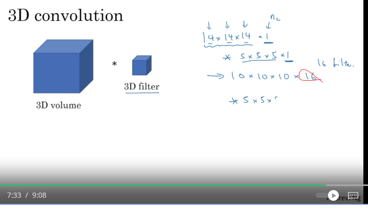

### Week 4 started on 12/12/2023
#### Learning Objectives
- **Main** Explore how CNNs can be applied to multiple fields, including art generation and face recognition, then implement your own algorithm to generate art and recognize faces.
- Differentiate between face recognition and face verification
- Implement one-shot learning to solve a face recognition problem.
- Apply the triplet loss function to learn a network's parameters in the context of face recognition.
- Explain how to pose face recognition as binary classification problem.
- Map face images into 128-dimensional encodings using a pretrained model.
- Perform face verification and face recognition with these encodings
- Implement the Neural Style Transfer.
- General novel artistic images using Neural Style Transfer.
- Define the style cost function for Neural Style Transfer.
- Define the content cost function for Neural Style Transfer
### What is facial recognition?
- Face verification vs face recognition
  - recognition is much harder than verification.
- **Face Verification**: input image, name/ID.
  - Output whether the input image is that of the claimed person
- **Recognition**: has a database of K persons, get an input image, output ID if the image is any of the K persons (or "not recognized")
- Recognition is harder because there are K-1 chances of getting it wrong.
### One Shot Learning
- Learning from one example to recognize the person again.
- A small training is not good. What if a new person joins your team? You will have to retrain the neural network?
#### Learning a "similarity" functon
- d(img1, img2) = degree of difference between images
- If d(img1, img2) <= tao "same"
    else > tao "different"
- Learning this function d allows us to solve the one shot learning problem.
### Siamese Network
- How can I learn the function d? This is the problem that the Siamese Network solves.
- Pass in two images. We are running two different images on two identical conv nets and getting the encoding of the images out of them. Then we take the norm between the two encodings.
#### Goal of Learning
- Learn parameters so that if for the same person the norm is small and for different persons the norm is large.
### Triplet Loss
#### Learning Objective
- Anchor and positive images (both are of the same person)
- Anchor and negative (both images are of different people)
- Want the norm of the anchor and positive to be less than or equal to the norm of the anchor/negative images. 
### Loss Function
- Given 3 images A, P, N.
- L(A, P, N)
- 
#### Choosing the triplets A,P,N
- During training, if A, P, N are chosen randomly then d(A,P) + \alpha <= d(A,N). because A and N will have a lot of distance presumably.
- Choose triplets that're "hard" to train on.
- Next we will look at variations on "siamese networks" and how to train these systems.
### Face Verification and Binary Classification
#### learning the similarity function
- We are using just pairs of images
  - 1 is the images is for the same person
  - 0 is the images are for different people.
### What is Neural Style Transfer?
- You want a picture recreated in the style of an artist.
### What are deep ConvNets learning?
#### Visualizing what a deep network is learning
- Pick a unit in layer 1, Find the nine image patches that maximize the unit's activation.
- repeat for other hidden units.
#### Visualizing deep layers
- Deeper layers detect more complex features 
  - This is so cool.
- Now let's use this intuition to start building a neura; style transfer algorithm.
### Cost Function
#### Neural Style Transfer Cost Function
- J(G) = J_content(C, G) how similar is the content of C(the original image) to the generated image (G) 
  - alpha and beta may be redundant here.
#### Find the generated image G
1. Initiate G randomly
2. Use gradient descent to minimize J(G)
- Next we need to define a content cost function and style cost function.
### Content Cost Function
- 
### Style Cost Function
#### Meaning of the "style" of an image
- Say you are using layer l's activation to measure "style" Define style as correlation between activations across channels.
  - How correlated are the activations across different channels?
  - ^Why does this capture style?
- The style is the correlation between the activations across channels.
- How correlated are the activations across different channels?
  - Look across the same positions across different channels.
  - **Intuition** this answers how often a feature like stripes and the color yellow occur together.
#### Intuition about style of an image
- So we are comparing the correlation between the layers of a image and then comparing across to different images and looking at their activations' correlations as well?
  - Then we compare the two correlations?
#### Style matrix
- 
#### Style cost function
- 
### 1D And 3D Generalizations
- Conv nets can be used in 1D data. It can change the output size as it would for 2D data. 
- The 16 here comes from the 16 filters. This number will be given if I am ever asked a question about this. 